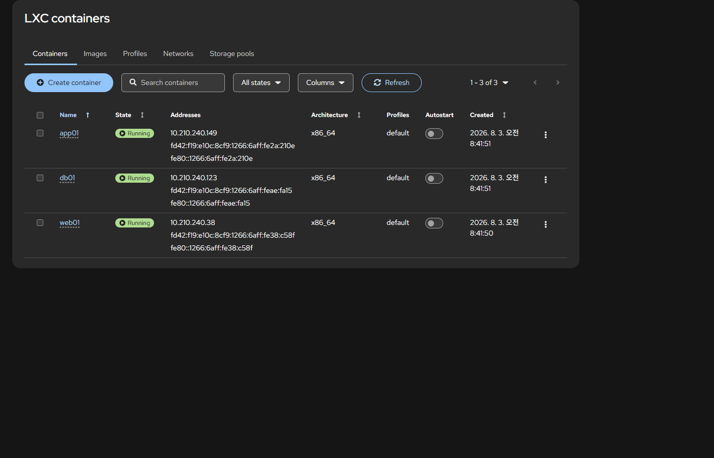
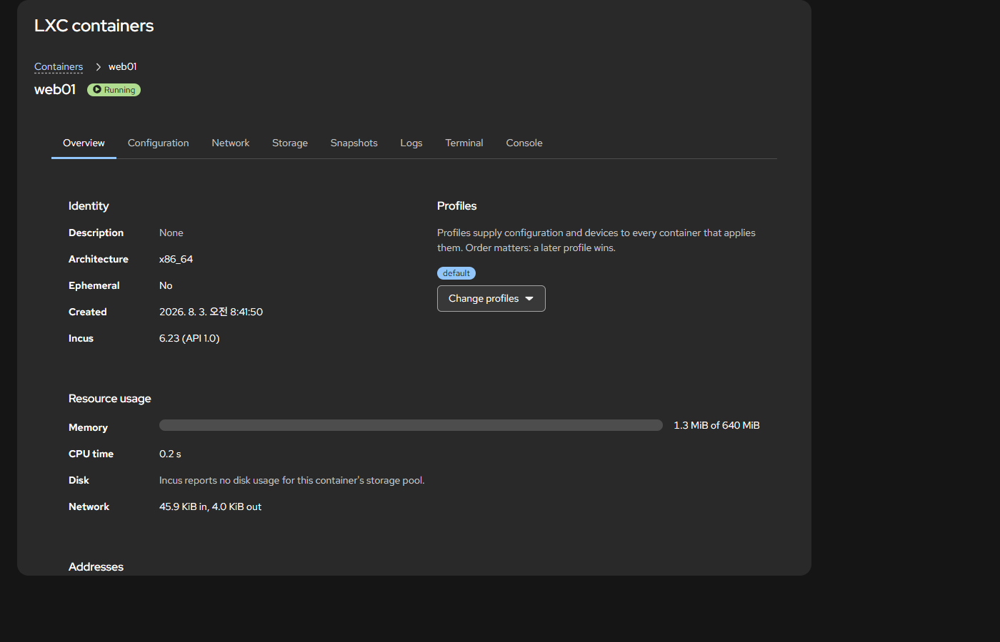
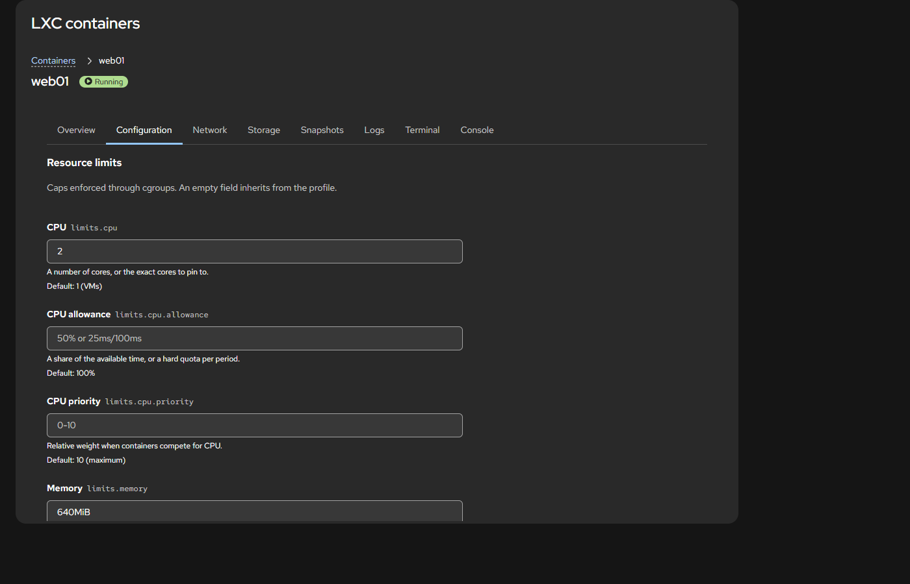
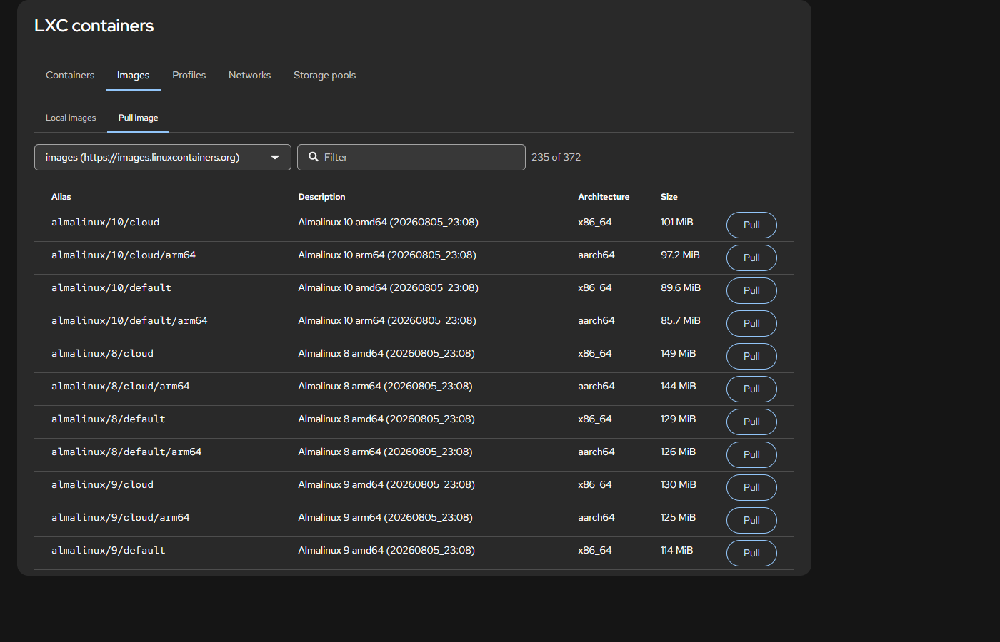
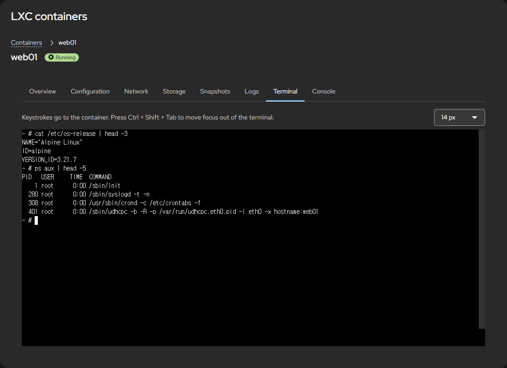

# cockpit-lxc

**English: [README.md](README.md)**

[Cockpit](https://cockpit-project.org/) 웹 콘솔 안의 한 페이지로, 브라우저에서 리눅스 시스템
컨테이너를 관리합니다.



## 이게 무엇인가

낯선 용어가 있다면 먼저 짧게 설명합니다.

- **Cockpit**은 리눅스 서버를 관리하는 웹 인터페이스입니다. 브라우저에서
  `https://서버주소:9090` 으로 열고 서버 계정으로 로그인합니다.
- **시스템 컨테이너**는 자체 init, 서비스, 사용자, 네트워크를 갖춘 완전한 리눅스 사용자
  공간이며 호스트 커널을 함께 씁니다. Docker 컨테이너보다는 작은 가상 머신에 훨씬 가깝고,
  오래 띄워두고 쓰라고 만든 것입니다.
- **[Incus](https://linuxcontainers.org/incus/)** 는 그 컨테이너를 만들고 실행하는
  관리자입니다. 평소 터미널에서 `incus launch`, `incus config` 같은 명령으로 다루던 그
  도구입니다.

`cockpit-lxc`는 Incus를 Cockpit 안으로 가져옵니다. 셸에서 타이핑하던 일을 클릭으로
처리하게 됩니다. 로그인은 새로 만들지 않고 이미 열려 있는 Cockpit 세션을 그대로 씁니다.

## 설치하기 전에

다음을 갖춘 리눅스 호스트가 필요합니다.

| 필요한 것 | 이유 |
|---|---|
| `cockpit` 300 이상 | 이 플러그인이 그 안의 한 페이지입니다 |
| `incus` 6.0 LTS 이상 | 컨테이너 관리자 본체입니다 |
| `incus` 명령줄 도구 | 터미널과 실시간 갱신이 이것을 통해 동작합니다 |
| `sudo`를 쓸 수 있는 계정 | Incus 소켓의 소유자가 root입니다 |

Incus가 없다면 먼저 설치합니다.

```sh
sudo dnf install incus incus-tools     # RHEL
sudo apt install incus incus-client    # Debian, Ubuntu
sudo pacman -S incus                   # Arch

sudo systemctl enable --now incus.socket
sudo incus admin init --auto           # Incus 최초 설정
```

## 설치

[최신 릴리스](https://github.com/heavycaffeiner/cockpit-lxc/releases/latest)에서 배포판에
맞는 패키지를 내려받은 뒤 설치합니다.

```sh
sudo dnf install ./cockpit-lxc-*.rpm          # RHEL
sudo apt install ./cockpit-lxc_*_all.deb      # Debian, Ubuntu
sudo pacman -U ./cockpit-lxc-*.pkg.tar.zst    # Arch
```

릴리스마다 `SHA256SUMS` 파일도 함께 올라갑니다. 받은 파일을 검증하려면:

```sh
sha256sum -c SHA256SUMS
```

재시작할 것은 없습니다. 다음번 페이지를 열 때 Cockpit이 알아서 인식합니다.

## 처음 실행하기

1. `https://서버주소:9090` 을 열고 로그인합니다.
2. 왼쪽 사이드바에서 **LXC Containers** 를 고릅니다.
3. Incus 소켓의 소유자가 root라서 페이지가 관리자 권한을 요구합니다. 오른쪽 위의
   **제한된 접근** 을 눌러 인증하십시오. 인증하면 페이지가 알아서 컨테이너를 불러옵니다.
4. 컨테이너가 아직 없다면 **이미지** 페이지의 **이미지 내려받기** 탭에서 하나 받은 뒤,
   컨테이너 페이지의 **컨테이너 만들기** 를 쓰십시오.

## 할 수 있는 일

- **컨테이너 운용**: 만들기, 시작, 정지, 재시작, 일시 정지, 이름 바꾸기, 복사, 삭제.
  여러 행을 골라 한 번에 처리할 수도 있습니다. 지금 상태에서 말이 되는 작업만 보여줍니다.
- **모든 설정 변경**: 자주 쓰는 설정이 라벨 붙은 필드로 먼저 나오고, 그 아래에 이 Incus
  버전이 지원하는 나머지 설정이 전부 나옵니다. Incus 자체 문서에서 가져온 설명과 기본값,
  그리고 다시 시작해야 적용되는지 여부까지 함께 표시됩니다.
- **네트워크와 디스크 연결**: 네트워크 인터페이스를 추가하고 호스트 경로를 마운트합니다.
  프로파일이 이미 주고 있는 것은 상속됨으로 표시되어 출처를 알 수 있습니다.
- **스냅샷**: 만들기, 복원, 이름 바꾸기, 삭제. 주기와 만료를 설정해 Incus가 알아서 찍게
  할 수도 있습니다.
- **이미지 관리**: 원격 이미지 서버를 훑어보고 필요한 것을 받고, 이미 가진 것에 이름을
  붙이거나 지웁니다.
- **프로파일, 네트워크, 저장소 풀 관리**: 각각 별도 페이지에서 만들고 편집하고 지웁니다.
- **셸 열기**: 실행 중인 컨테이너 안의 진짜 터미널과 콘솔.
- **로그 보기**: Incus가 컨테이너에 대해 남기는 로그 파일.

목록은 컨테이너가 시작되고 멈추는 대로 스스로 갱신됩니다. 그 실시간 연결이 끊기면 오래된
정보를 최신인 척 보여주지 않고 끊겼다고 분명히 알려줍니다.

### 컨테이너 상세

신원, 적용된 프로파일, 지금 쓰고 있는 자원.



### 서버가 지원하는 모든 설정

자주 쓰는 설정이 제대로 된 라벨과 도움말과 함께 위에 있습니다. 그 아래에는 이 Incus
버전이 아는 나머지 옵션이 Incus가 묶는 방식 그대로 묶여 있습니다. 각 제목 옆 숫자는 이
서버에서 그 묶음이 실제로 가진 설정 개수입니다.



### 훑어보고 고르는 이미지

이미지 이름을 짐작해서 타이핑하는 대신 원격 저장소의 카탈로그에서 고릅니다. 내려받기는
별도 탭이라, 컨테이너를 만드는 일이 슬그머니 긴 다운로드로 변하지 않습니다.



### 컨테이너 안의 셸

브라우저를 벗어나지 않고 쓰는 진짜 터미널. 크기 조정과 색상도 동작합니다.



## 지원 배포판

세 가지이며, 각각 같은 소스에서 자동으로 빌드되어 배포됩니다.

| 배포판 | 패키지 |
|---|---|
| RHEL 계열 | `.rpm` |
| Debian, Ubuntu | `.deb` |
| Arch | `.pkg.tar.zst` |

이 플러그인은 컴파일된 부분이 없는 정적 파일 묶음이라, 위 배포판이라면 Cockpit과 Incus가
충분히 새롭기만 하면 어느 버전에서든 동작합니다. 다른 배포판도 소스 설치로는 대부분 될
것입니다. 다만 이 프로젝트가 빌드하거나 테스트하지는 않습니다.

## 문제가 생겼다면

**"Incus가 설치되어 있지 않습니다"** 는 Incus 소켓을 찾지 못했다는 뜻입니다. Incus를
설치하고 시작하십시오.

```sh
sudo systemctl enable --now incus.socket
```

**"관리자 권한이 필요합니다"** 는 처음 쓸 때 정상입니다. Cockpit 오른쪽 위의
**제한된 접근** 을 눌러 인증하십시오. Incus 소켓은 root만 읽을 수 있어서, 인증하기
전까지는 페이지가 아무것도 보여줄 수 없습니다.

**실시간 갱신을 쓸 수 없다고 나옵니다.** 목록 자체는 마지막으로 새로 고친 시점 기준으로
정확하며, 다만 스스로 갱신되지 않습니다. 이벤트 스트림을 나르는 `incus` 명령줄 도구가
설치되어 있는지 확인하십시오.

**컨테이너에 IPv4 주소가 없습니다.** 대개 이 플러그인이 아니라 호스트 방화벽 문제입니다.
firewalld를 쓰는 호스트라면 Incus 브리지가 DHCP를 허용하는 zone에 있어야 합니다.

```sh
sudo firewall-cmd --permanent --zone=trusted --add-interface=incusbr0
sudo firewall-cmd --reload
```

**그 밖의 문제.** 배포판, Cockpit과 Incus 버전, 그리고 무엇을 보았는지를 적어
[이슈를 열어](https://github.com/heavycaffeiner/cockpit-lxc/issues) 주십시오.

## 직접 빌드하기

```sh
npm install
make build
sudo make install     # /usr/share/cockpit/lxc 로 설치
```

패키지를 만들려면 `make rpm`, `make deb`, `make arch` 중 하나를 쓰십시오.

## 기여하기

프로젝트 구조, 검사 실행 방법, 빌드가 강제하는 규칙은
[CONTRIBUTING.md](CONTRIBUTING.md) 에 있습니다. 개발 문서는 영어로 되어 있습니다.

## 라이선스

Cockpit과 같은 LGPL-2.1-or-later입니다. 전문은 `LICENSE` 에 있습니다.
