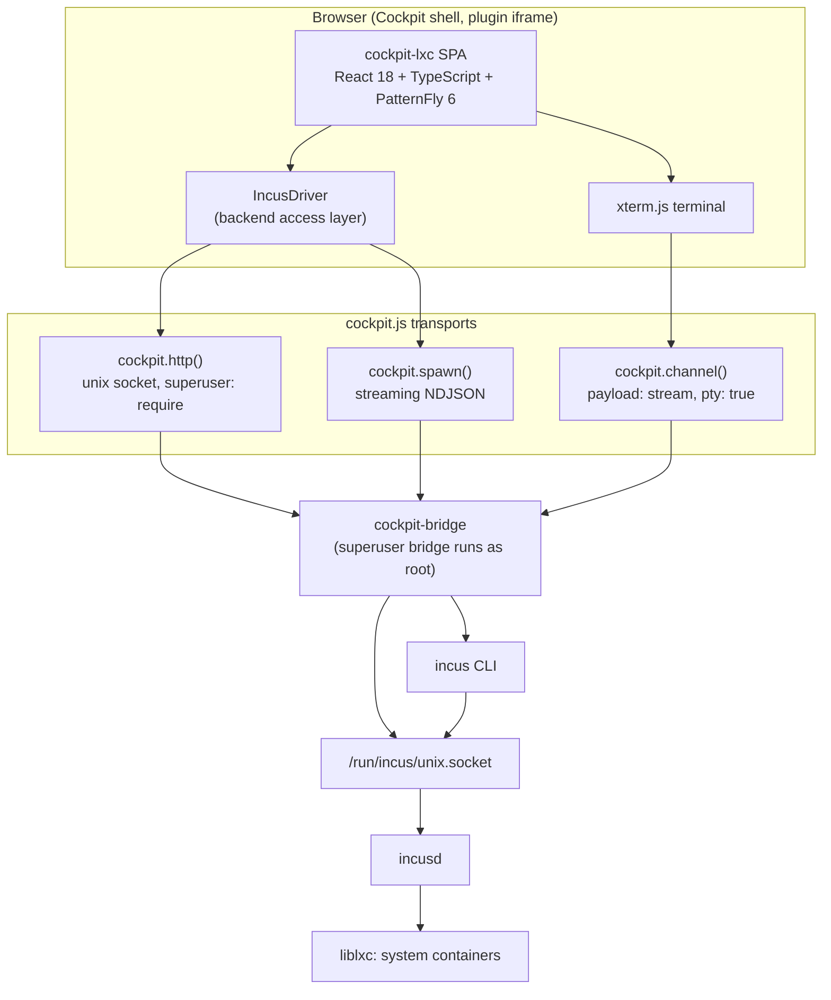

# cockpit-lxc: LXC/Incus Container Management Plugin - Spec Proposal

| Item       | Detail                           |
|------------|----------------------------------|
| Author     | heavycaffeiner(Dong Hyun Kim)    |
| Created    | 2026-08-03                       |
| Status     | Draft / In Review / **Approved** |
| Reviewers  | heavycaffeiner(Dong Hyun Kim)    |

---

## 1. Summary

`cockpit-lxc` is a Cockpit package that brings full lifecycle and configuration
management of LXC system containers into the Cockpit web console. It targets Incus as
the container manager, reaching `incusd` over its local REST socket through
`cockpit-bridge`, so it inherits Cockpit's existing authentication and privilege
escalation rather than introducing a second auth model. The plugin is built entirely
from PatternFly 6 components and design tokens so that it is visually indistinguishable
from Cockpit's built-in pages, and every layout dimension resolves to a multiple of 4px.
It provides an in-browser interactive terminal attached to any running container, and
exposes every container setting Incus can express so that an operator never has to drop
to a host shell.

## 2. Background & Motivation

### 2.1 The gap

Cockpit ships first-party management for application containers (`cockpit-podman`) and
for virtual machines (`cockpit-machines`). It has nothing for system containers. This is
the one workload class in between: a full Linux userspace with its own init, service
manager, users and network stack, but sharing the host kernel. Operators who run system
containers today manage them from a terminal.

### 2.2 Why Incus rather than raw liblxc

`liblxc` and Incus are not competing products at the same layer. `liblxc` is the
low-level runtime that creates the namespaces and cgroups; Incus is a higher-level
manager that drives `liblxc` for its container workloads. Choosing Incus does not mean
abandoning LXC, it means consuming LXC through a managed API.

Both projects are maintained by the same team at linuxcontainers.org and both released a
7.0 LTS in April 2026, so neither is "newer" in a version sense. They differ in interface
surface, and that difference is decisive for this proposal:

| Concern | Raw liblxc | Incus |
|---|---|---|
| Programmatic interface | `lxc-*` CLI plus the `/var/lib/lxc/<name>/config` text file | REST API over a unix socket |
| State query | Parse `lxc-info` output; polling only | `GET /1.0/instances`, `GET /1.0/metrics` |
| Change events | None | `incus monitor` event stream |
| Networks and storage | Not modelled; the host bridge is managed out of band | First-class API objects |
| Concurrency safety on writes | None; last writer wins on a shared text file | ETag with `If-Match` preconditions |
| Release cadence | LTS-focused maintenance | Monthly feature releases |

The requirement is that *all* container settings be editable from the web UI. On raw
liblxc that would mean hand-writing a parser and serializer for `lxc.container.conf` that
preserves comment placement and key ordering, re-indexes `lxc.net.N.*` blocks when a NIC
is removed, and writes atomically to avoid corrupting a container definition on a partial
write. That is a large amount of fragile, security-sensitive code that produces no user
value on its own. It is also unsafe: two Cockpit sessions editing the same file have no
way to detect the conflict.

The scope problem is worse than the parsing problem. Raw liblxc has no concept of a
network or a storage pool. Creating a bridge would mean editing the host's
`systemd-networkd` or `/etc/network/interfaces` directly, which expands the plugin's
remit from container management to host network management.

**Decision: Incus, confirmed.** Three facts settle it:

1. **Incus is a superset, not an alternative.** The `raw.lxc` instance option accepts
   "raw LXC configuration to be appended to the generated one", so anything expressible
   in `lxc.container.conf` remains reachable through Incus. The reverse does not hold.
   The raw key/value editor in 3.1 therefore covers `raw.lxc` as well, which is what
   makes the "every setting" goal literally true rather than approximately true.
2. **The maturity argument does not favour raw liblxc.** Incus inherits the LXD codebase
   from 2015 and its original maintainers, so its effective age is roughly a decade, not
   the two years since the fork. More to the point, Incus runs its system containers *on*
   liblxc, so this choice does not trade away liblxc's stability. The least mature code
   in a raw-liblxc build of this plugin would be the config parser, serializer and
   concurrency handling that this proposal would have to author from scratch.
3. **Existing containers are not stranded.** `lxc-to-incus --all` migrates both the data
   and as much of the configuration as it can translate, for containers on the same host.
   Containers must be stopped first, and names that already exist in Incus must be
   renamed beforehand.

What this costs, stated plainly: a Go daemon of a few tens of megabytes where raw liblxc
needs only a library, and one more layer of ownership, since containers created through
Incus must not be manipulated with `lxc-*` directly.

### 2.3 Why a Cockpit plugin rather than the existing Incus UI

Incus ships no official web UI. The only browser frontend in practice is
`incus-ui-canonical`, a community patch of Canonical's LXD-UI, served as a stateless SPA
from `/opt/incus/ui/`. It authenticates with its own client-certificate flow: the operator
must generate a certificate, add it to the Incus trust store, and import it into the
browser. For a host that is already running Cockpit, this means a second application, a
second navigation model, a second design language, and a second credential to manage.

A Cockpit plugin removes all four. Cockpit has already authenticated the operator and
already holds a privileged bridge; the plugin reuses both.

### 2.4 Why the 4px grid is a hard requirement

PatternFly 6's spacer scale is built on a 0.25rem increment, which at Cockpit's 16px root
font size is exactly 4px. Every PF6 spacer token (`xs` 0.25rem, `sm` 0.5rem, `md` 1rem,
`lg` 1.5rem, `xl` 2rem, `2xl` 3rem, `3xl` 4rem, `4xl` 5rem) is a multiple of it, as are
the derived control, gap and inset tokens. Cockpit's own pages inherit this scale.

The failure mode is specific and cumulative: a single hand-written `padding: 10px` does
not look broken in isolation, but it puts every element below it off the shared baseline,
and next to a built-in Cockpit page the plugin reads as foreign without the reviewer being
able to say why. Catching this in code review does not scale. It has to be mechanical.

## 3. Goals & Non-Goals

### 3.1 Goals

- [ ] Present a container list with live state, and support create, start, stop, restart, freeze, thaw, rename, copy and delete.
- [ ] Provide a container detail view with tabs for Overview, Configuration, Network, Storage, Snapshots, Terminal, Console and Logs.
- [ ] Make every Incus-expressible container setting editable from the UI: resource limits (CPU count, CPU set, CPU allowance, memory limit, memory enforcement, swap, disk and network I/O priority, process limit), NIC devices, disk and bind-mount devices, applied profiles, security posture (privileged, nesting, idmap, AppArmor, seccomp, syscall interception), boot behaviour (autostart, priority, start delay, stop timeout), environment variables, and `cloud-init` user data.
- [ ] Expose an escape hatch: a raw key/value editor over the instance `config` map for any key the typed forms do not cover, so "all settings" holds even as Incus adds keys. This necessarily includes `raw.lxc`, `raw.apparmor`, `raw.idmap` and `raw.seccomp`, which is what keeps the full `lxc.container.conf` surface reachable (see 2.2).
- [ ] Provide an interactive terminal into a running container over xterm.js, with working resize, 256-colour output and correct signal handling.
- [ ] Provide access to the container's tty console as a separate tab.
- [ ] Reflect container state changes pushed by Incus without user-initiated refresh.
- [ ] Show per-container CPU, memory, disk and network metrics.
- [ ] Manage snapshots: create, restore, rename, delete, and configure snapshot expiry and schedule.
- [ ] Manage images: browse configured remotes, pull an image, list and delete local images, set aliases.
- [ ] Manage profiles, networks and storage pools as their own top-level pages, since container configuration is meaningless without them.
- [ ] Render exclusively in PatternFly 6, with every spacing, sizing and layout value resolving to a multiple of 4px, enforced by an automated check in CI.
- [ ] Degrade to a read-only view when the session lacks administrative access, rather than failing.
- [ ] Localize all user-facing strings through Cockpit's gettext integration.
- [ ] Ship as both a `.deb` and an `.rpm`, plus a source install path.

### 3.2 Non-Goals

- [ ] Incus virtual machines. The plugin filters to `type: container` instances. VMs are Cockpit-machines' territory and their config surface differs enough to warrant its own proposal.
- [ ] Incus clustering administration (member join/evacuate/restore, cluster group management). The plugin will operate correctly against a single member of a cluster but will not manage the cluster.
- [ ] Raw `liblxc` containers under `/var/lib/lxc`, Proxmox `pct` containers, and Canonical LXD. The backend access layer is isolated behind one interface (see 4.1) so that a future proposal can add a driver, but no such driver is in this scope.
- [ ] Installing or bootstrapping `incusd` itself. The plugin detects an absent or unreachable Incus and shows an actionable empty state; it does not run `incus admin init`.
- [ ] Managing the Incus trust store, certificates, or OIDC/OpenFGA authorization configuration.
- [ ] A file browser or file editor for container filesystems.
- [ ] Managing remote Incus servers over HTTPS. Only the local unix socket is in scope.
- [ ] Any custom privileged daemon, helper service, or setuid binary.

## 4. Technical Design

### 4.1 Architecture Overview

The plugin is a static Cockpit package. It has no server-side component of its own: all
privileged work is carried by `cockpit-bridge`, which Cockpit already runs and already
authenticates.



#### 4.1.1 Three transports, and why there are three

**Transport 1: REST over the unix socket.** All reads and all configuration writes go
through `cockpit.http()`, which accepts a unix socket path and a `superuser` field:

```ts
const http = cockpit.http({
    unix: "/run/incus/unix.socket",
    superuser: "require",
});
```

The path is `/run/incus`, not `/var/lib/incus`: the systemd unit declares
`ListenStream=/run/incus/unix.socket`, and `/var/lib/incus` holds the daemon's state
rather than its socket.

The socket is owned `root:incus-admin` with mode 0660. Cockpit's superuser bridge runs as
root, so `superuser: "require"` gives access and, importantly, makes Cockpit surface its
standard "Administrative access" prompt when the session has not yet escalated. This is
the single point where the plugin depends on privilege.

Verified against Incus 6.23 on Rocky Linux 10.2: `GET /1.0` over this socket returns a
`sync` envelope with `auth: "trusted"`, `api_version: "1.0"` and 510 API extensions,
which is the shape the startup sequence in 4.3.1 depends on.

**Transport 2: pty stream for the terminal.** Incus's own exec endpoint
(`POST /1.0/instances/<name>/exec`) upgrades to websockets for its stdin/stdout/control
streams. `cockpit.http()` speaks HTTP request/response only and cannot perform a
websocket upgrade. Rather than reimplement the Incus websocket exec protocol on top of a
raw Cockpit channel, the plugin spawns the `incus` CLI inside a pty and streams that:

```ts
const channel = cockpit.channel({
    payload: "stream",
    spawn: ["incus", "exec", instanceName, "--", "/bin/sh", "-c",
            "exec $(command -v bash || command -v sh)"],
    environ: ["TERM=xterm-256color"],
    pty: true,
    binary: true,
    superuser: "require",
});
```

This is the same mechanism Cockpit's own System terminal uses, so xterm.js integration,
resize propagation and binary framing all follow an existing, tested path. The tradeoff is
an added dependency on the `incus` CLI binary being present, which is acceptable because
it is part of the same package set as `incusd`.

**Transport 3: event stream.** `GET /1.0/events` is likewise a websocket. The plugin
instead spawns `incus monitor --format=json --type=lifecycle,operation` and parses the
resulting newline-delimited JSON from the channel's stream callback. This drives live
state updates without polling.

Metrics are the exception that stays on transport 1: `GET /1.0/metrics` returns an
OpenMetrics text body over plain HTTP and is polled on a fixed interval.

#### 4.1.2 Why no custom backend daemon

A common alternative is to ship a small Python or Go helper that Cockpit invokes. This is
rejected. `cockpit-bridge` already provides exactly what such a helper would provide, an
authenticated privileged transport, and it is already installed, already audited and
already covered by Cockpit's session lifecycle. Adding a daemon would duplicate that,
widen the security surface, and add a systemd unit and a socket to the packaging. The
plugin stays a static asset bundle.

#### 4.1.3 Backend access layer

All Incus interaction is confined to a single module, `src/backend/`. The rest of the
application imports only the `ContainerDriver` interface and the domain types. Nothing
outside `src/backend/` may import `cockpit` directly, enforced by an ESLint
`no-restricted-imports` rule. This keeps the door open for a future `liblxc` driver
without a rewrite, while adding no abstraction that is not already needed to make the
current code testable.

#### 4.1.4 Package layout

```
/usr/share/cockpit/lxc/
    manifest.json
    index.html
    index.js          # esbuild bundle
    index.css
    po.*.js           # compiled translations
```

`manifest.json`:

```json
{
    "version": 0,
    "requires": { "cockpit": "300" },
    "menu": {
        "index": {
            "label": "LXC Containers",
            "order": 40,
            "keywords": [
                { "matches": ["lxc", "incus", "container", "system container"] }
            ]
        }
    }
}
```

The entry sits under `menu` rather than `tools` because container management is a primary
system function, consistent with where `cockpit-machines` and `cockpit-podman` place
themselves.

### 4.2 Data Model Changes

**No persistent schema changes.** The plugin owns no database, no table, and no
configuration file of its own. All authoritative state lives in Incus, under
`/var/lib/incus`, and is reached only through the API.

Two categories of client-side state exist, both non-authoritative:

**In-memory store.** A normalized cache, keyed by instance name, holding the last known
`Instance` object, its ETag, and a `dirty` flag set when an event indicates the object
changed. It is rebuilt from `GET /1.0/instances?recursion=2` on mount and reconciled
incrementally from the event stream. It is never written to disk.

**Browser-local UI preferences.** Stored under `localStorage` key `cockpit-lxc:prefs`,
holding only presentation state: selected table columns, sort order, page size, terminal
font size, and last-opened detail tab. It contains no container data and no credentials.
Absent or malformed values fall back to defaults, so clearing it is always safe.

```ts
/** Client-side cache entry. Not authoritative; Incus is. */
interface CachedInstance {
    /** Instance name; primary key in Incus's namespace. */
    name: string;
    /** Full instance object from GET /1.0/instances/<name>. */
    data: Instance;
    /** ETag header value from the same GET. Required for safe writes. */
    etag: string;
    /** Set when an event says this changed; triggers a targeted refetch. */
    dirty: boolean;
}
```

### 4.3 Core Logic

#### 4.3.1 Startup and capability detection

On mount the plugin runs a fixed sequence before rendering any container data. Each step
has one defined failure state, and every failure produces a distinct, actionable empty
state rather than a generic error.

1. `GET /1.0`. On transport failure with `problem === "not-found"`, the socket does not
   exist: render "Incus is not installed on this host."
2. On transport failure with `problem === "access-denied"`, the session is not
   privileged: render "Administrative access is required", wired to Cockpit's
   `superuser.reload_page_on_change()` so that escalating re-runs the sequence.
3. On success, read `metadata.api_version` and `metadata.auth`. If `auth !== "trusted"`,
   render "This session is not trusted by Incus."
4. Read `metadata.environment.server_version` and compare against the minimum supported
   version. Below it, render a warning banner but continue in read-only mode.
5. Read `metadata.api_extensions` into a `Set`. Feature-gated UI (for example the
   snapshot scheduler, which requires the `snapshot_scheduling` extension) checks this
   set and hides rather than renders a control that would fail at submit time.

#### 4.3.2 The Incus response envelope

Every Incus response is an envelope with a `type` discriminator. Handling this correctly
is the single most load-bearing detail in the client, because getting it wrong produces a
UI that reports success while the operation is still running or has failed.

```
type: "sync"   -> metadata holds the result; the operation is complete.
type: "async"  -> HTTP 202; metadata holds an Operation object; work is in flight.
type: "error"  -> error_code and error hold the failure.
```

For `async`, the response is not the result. The client must extract the operation UUID
and wait on it:

```
POST /1.0/instances/web01/state   -> 202, metadata.id = "<uuid>"
GET  /1.0/operations/<uuid>/wait?timeout=-1
     -> sync envelope; metadata.status_code 200 = Success, 400 = Failure,
        401 = Cancelled; metadata.err holds the reason on failure.
```

A `timeout` of `-1` blocks until the operation settles. The plugin instead passes a
bounded timeout (30 seconds) and re-issues the wait, so that a hung operation surfaces as
a cancellable in-progress state in the UI rather than an indefinitely pending promise.
Operation progress, where Incus reports it (`metadata.metadata.download_progress` during
an image pull), is surfaced on a PatternFly `Progress`.

#### 4.3.3 Configuration writes and concurrency

Incus supports optimistic concurrency through ETags, and the plugin must use it. The
failure this prevents is concrete: two operators with the detail page open, one sets a
memory limit, the other sets a CPU limit, and without preconditions the second write
silently reverts the first.

Two write paths, chosen by intent:

**Full replace, for the configuration forms.** `GET /1.0/instances/<name>` returns an
`ETag` header. The form is edited against that snapshot, then submitted with
`PUT /1.0/instances/<name>` carrying `If-Match: <etag>`. A `412 Precondition Failed`
means the object changed underneath; the plugin refetches, computes which keys differ
from the snapshot the user started from, and shows a conflict dialog listing them rather
than discarding the user's input. `PUT` is required here specifically because it is the
only way to *remove* a config key: a key omitted from a `PUT` body is deleted, whereas
`PATCH` cannot express removal.

**Merge, for single-control toggles.** A toggle in a table row (autostart on/off) uses
`PATCH /1.0/instances/<name>` with only the affected key. `PATCH` merges and cannot
delete, so there is no clobbering risk and no ETag round-trip is needed.

Validation happens at three layers, and the outer two exist because the browser is not a
trust boundary but the API is:

1. **Field level, on the client**, for immediate feedback: memory limits match
   `^\d+(\.\d+)?(B|kB|MB|GB|TB|KiB|MiB|GiB|TiB)?$`, `limits.cpu` is either a count or a
   CPU set expression, percentages are 0 to 100.
2. **Form level, on the client**, for cross-field rules the API would reject: for example
   `limits.memory.swap` is meaningless without `limits.memory`.
3. **Server level.** The client never assumes its own validation was sufficient. A `400`
   from Incus is parsed and its `error` string is mapped back to the offending field
   where the message identifies one, and shown as a form-level alert otherwise.

#### 4.3.4 Terminal lifecycle

The terminal tab owns one Cockpit channel per mounted session.

1. On tab activation, check the container is `Running`. If not, render a start prompt
   rather than opening a channel that would immediately fail.
2. Open the pty channel described in 4.1.1.
3. On the channel's `ready` event, record `msg.pid` and mark the terminal live.
4. Wire xterm.js: `term.onData(d => channel.send(d))` and
   `channel.addEventListener("message", (_, data) => term.write(data))`. `binary: true`
   means payloads are `Uint8Array`, which xterm.js accepts directly, so no UTF-8
   round-trip through a string is performed and multi-byte characters split across chunk
   boundaries are handled by xterm.js's own decoder rather than being corrupted.
5. Resize: a `ResizeObserver` on the container element drives xterm's `FitAddon`, and each
   resulting `onResize` sends a control message
   `channel.control({ command: "resize", rows, cols })`.
6. On the `close` event, write the reason into the terminal buffer as a dim line and
   render a Reconnect action. The buffer is deliberately retained so that output
   preceding an unexpected exit is not lost.
7. On unmount or tab switch away, `channel.close()`. The channel is not kept alive in the
   background: an orphaned pty on the host is a resource leak, and Cockpit gives no
   guarantee the iframe survives navigation.

The shell selection command in 4.1.1 falls back from `bash` to `sh` inside the container,
because minimal images frequently have no bash and a hard-coded `/bin/bash` would fail
with a bare "no such file" that reads as a plugin bug.

The Console tab is the same machinery with a different spawn: `incus console <name>`.
It carries an explicit warning that console output is shared, since Incus permits only
one console attachment at a time.

#### 4.3.5 Event reconciliation

`incus monitor --format=json` emits one JSON object per line. The plugin attaches to the
`cockpit.spawn` stream callback, buffers partial lines across chunk boundaries, and
dispatches on `type`:

- `lifecycle`: `metadata.action` is a dotted string such as `instance-started`,
  `instance-stopped`, `instance-updated`, `instance-deleted`. The affected instance is
  parsed from `metadata.source` (`/1.0/instances/<name>`). Deletion removes the cache
  entry; everything else marks it `dirty`.
- `operation`: used only to drive progress on operations this client initiated, matched by
  operation UUID.

Dirty entries are refetched on a 500ms trailing debounce, coalescing bursts (a
`start` that emits several lifecycle events) into one request.

If the monitor channel closes unexpectedly, the plugin falls back to a 10 second full
poll and retries the monitor with exponential backoff capped at 60 seconds. The UI shows a
subtle "Live updates unavailable" indicator in this state rather than silently going
stale, because a stale container list that looks live is worse than an honestly degraded
one.

#### 4.3.6 Destructive operation guards

Deleting a container destroys its root filesystem, and Incus will not recover it. Every
destructive action is guarded:

- Delete requires typing the container name to confirm, following Cockpit's own
  established pattern for irreversible actions.
- The dialog states plainly what will be destroyed, including the number of snapshots that
  will go with it.
- Deleting a running container is refused with a clear message rather than silently
  force-stopping it.
- Snapshot restore warns that state written since the snapshot will be lost, and shows the
  snapshot's creation time so the operator can judge the loss.
- Bulk actions from the table confirm once with a full list of affected containers.

#### 4.3.7 The 4px grid, enforced

The rule: **every spacing, sizing and positional length in plugin CSS is a multiple of
4px.** This is not a review guideline, it is a build gate.

*Primary mechanism: tokens only.* Component styles reference PatternFly 6 tokens and never
literal lengths for spacing:

```css
.lxc-detail__section {
    padding-block: var(--pf-t--global--spacer--md);      /* 16px */
    gap: var(--pf-t--global--spacer--sm);                /* 8px  */
    margin-block-end: var(--pf-t--global--spacer--lg);   /* 24px */
}
```

Because the entire PF6 spacer scale is built on a 0.25rem increment, anything expressed
purely in tokens is on the grid by construction. Layout uses PatternFly's `Grid`,
`Flex`, `Stack` and `Split` components with token-valued gaps rather than bespoke CSS.

*Backstop: a lint rule.* Tokens cover the common case but not every case, so a stylelint
rule rejects off-grid literals in the properties where they matter:

```js
// .stylelintrc.js
const GRID_PROPS = [
    "margin", "margin-block", "margin-inline", "margin-top", "margin-right",
    "margin-bottom", "margin-left", "padding", "padding-block", "padding-inline",
    "padding-top", "padding-right", "padding-bottom", "padding-left",
    "gap", "row-gap", "column-gap", "top", "right", "bottom", "left",
    "width", "height", "min-width", "min-height", "inset",
];

module.exports = {
    extends: ["stylelint-config-standard"],
    plugins: ["./build/stylelint-4px-grid.js"],
    rules: {
        // Rejects any px or rem literal in GRID_PROPS that does not resolve to a
        // multiple of 4px at a 16px root. Permits 0, percentages, auto, and any
        // var() reference. Escape hatch: a per-line stylelint-disable comment,
        // which must carry a justification and is surfaced in review.
        "cockpit-lxc/four-px-grid": [true, { properties: GRID_PROPS, base: 4 }],
    },
};
```

`npm run lint:css` runs it, `make check` depends on it, and CI fails on violation. The
plugin bundle contains no third-party CSS beyond PatternFly itself, so there is no
vendored stylesheet to exempt.

*Derived rules that follow from the same constraint:*

- **Line heights snap to 4px.** PF6 body text is 16px at a 1.5 ratio, which is 24px, on
  grid. Any custom type style must state its line height in a value that lands on a
  multiple of 4, and the lint rule covers `line-height` when expressed as a length.
- **Icon sizes are 16, 20, 24 or 32px.** No other values.
- **Component heights are token-derived.** Table row height, toolbar height and card
  padding come from PatternFly and are not overridden. Where a height must be set (the
  terminal viewport), it is computed as `rows * cellHeight` and the container is sized in
  whole 4px steps, with any remainder absorbed by a flex spacer rather than by an off-grid
  height.
- **Borders are exempt.** A 1px border is not spacing, and forcing it to 4px would be
  absurd. The lint rule does not cover `border-*` or `outline-*`.

*Verification aid:* a development-only overlay, toggled by `?grid=1`, paints a 4px
repeating linear-gradient over the page so misalignment is visible during development. It
is stripped from production builds by an esbuild `define` on `process.env.NODE_ENV`.

#### 4.3.8 Accessibility

PatternFly 6 components carry correct roles and keyboard behaviour, but three areas in
this plugin need explicit work because they are not solved by component choice:

- **The terminal.** xterm.js renders to a canvas and is opaque to screen readers. The
  plugin enables xterm's `screenReaderMode`, which maintains a live accessibility buffer,
  labels the container with an accessible name identifying which container it is attached
  to, and documents that the escape sequence to leave the terminal region is Ctrl+Shift+Tab
  in a visible hint above it.
- **State is never colour alone.** Container state renders as a PatternFly `Label` with
  both an icon and text ("Running", "Stopped", "Frozen"), so it survives greyscale and
  colour-vision deficiency. The same applies to metric thresholds.
- **Focus on async actions.** After an operation completes and the dialog closes, focus
  returns to the control that opened it. Operation results are announced through an
  `aria-live="polite"` region so that a long-running start or stop is not silent to a
  screen reader user.

Contrast is inherited from PF6 tokens, which meet WCAG AA in both the light and dark
themes Cockpit supports; no custom colour is introduced outside the token set.

## 5. API Design

### 5-1. New / Modified

The plugin authors no HTTP API. This section therefore specifies (a) the Incus endpoints
consumed and (b) the internal driver interface that the rest of the application programs
against.

#### 5-1-1. Incus endpoints consumed

| Method | Path | Sync/Async | Purpose |
|---|---|---|---|
| GET | `/1.0` | sync | Server info, auth state, API extensions |
| GET | `/1.0/instances?recursion=2` | sync | Full instance list with state and config |
| GET | `/1.0/instances/<name>` | sync | Single instance; returns `ETag` |
| POST | `/1.0/instances` | async | Create instance from image |
| PUT | `/1.0/instances/<name>` | async | Full config replace; requires `If-Match` |
| PATCH | `/1.0/instances/<name>` | async | Partial config merge |
| POST | `/1.0/instances/<name>` | async | Rename or migrate |
| DELETE | `/1.0/instances/<name>` | async | Delete instance |
| PUT | `/1.0/instances/<name>/state` | async | start, stop, restart, freeze, unfreeze |
| GET | `/1.0/instances/<name>/state` | sync | Live state, network addresses, usage |
| GET | `/1.0/instances/<name>/snapshots?recursion=1` | sync | Snapshot list |
| POST | `/1.0/instances/<name>/snapshots` | async | Create snapshot |
| DELETE | `/1.0/instances/<name>/snapshots/<snap>` | async | Delete snapshot |
| GET | `/1.0/instances/<name>/logs` | sync | Log file list |
| GET | `/1.0/instances/<name>/logs/<file>` | sync | Log contents |
| GET | `/1.0/images?recursion=1` | sync | Local images |
| POST | `/1.0/images` | async | Pull image from remote |
| GET | `/1.0/profiles?recursion=1` | sync | Profiles |
| PUT | `/1.0/profiles/<name>` | sync | Update profile |
| GET | `/1.0/networks?recursion=1` | sync | Networks |
| GET | `/1.0/storage-pools?recursion=1` | sync | Storage pools |
| GET | `/1.0/operations/<uuid>/wait` | sync | Block on an async operation |
| GET | `/1.0/metrics` | sync | OpenMetrics text for all instances |

Restore is expressed as a `PUT /1.0/instances/<name>` whose body sets `restore` to the
snapshot name, not as a distinct endpoint.

#### 5-1-2. Driver interface

```ts
/**
 * The single seam between the UI and the container manager. Everything above
 * this interface is backend-agnostic; everything below it is Incus-specific.
 * A future liblxc driver would implement this same interface.
 */
export interface ContainerDriver {
    /**
     * Probe the backend and return its capabilities. Called once at startup,
     * before any other method. Rejects with a DriverError whose `kind` field
     * distinguishes "not-installed", "access-denied" and "untrusted", because
     * each maps to a different empty state in the UI.
     */
    probe(): Promise<ServerInfo>;

    /**
     * List all system containers. VMs are filtered out by `type === "container"`.
     * Uses recursion=2 so that state arrives in the same round trip; this is a
     * deliberate bandwidth-for-latency trade, since the list view needs state.
     */
    listContainers(): Promise<Container[]>;

    /**
     * Fetch one container together with the ETag needed to write it back safely.
     * The ETag is opaque to callers and must be passed through to updateConfig.
     */
    getContainer(name: string): Promise<{ container: Container; etag: string }>;

    /**
     * Replace the full configuration. `etag` must be the value from the
     * getContainer call the edit was based on. Rejects with a ConflictError
     * carrying the current server-side object when the precondition fails,
     * so the caller can present a conflict rather than losing the user's input.
     *
     * Keys absent from `config` are REMOVED. This is the only way to unset a key.
     */
    updateConfig(name: string, config: ContainerConfig, etag: string): Promise<void>;

    /**
     * Merge a partial configuration. Cannot remove keys. No ETag required,
     * because a merge of disjoint keys cannot clobber a concurrent edit.
     */
    patchConfig(name: string, partial: Partial<ContainerConfig>): Promise<void>;

    /**
     * Change run state. `force` maps to Incus's force flag and, for stop, means
     * SIGKILL rather than a clean shutdown; callers must have confirmed with the
     * user before setting it. `timeout` is the graceful shutdown window in seconds.
     */
    setState(
        name: string,
        action: "start" | "stop" | "restart" | "freeze" | "unfreeze",
        opts?: { force?: boolean; timeout?: number },
    ): Promise<void>;

    /** Create from an image. Resolves only after the async operation settles. */
    createContainer(spec: CreateContainerSpec): Promise<void>;

    /** Delete a container and all of its snapshots. Refuses if it is running. */
    deleteContainer(name: string): Promise<void>;

    listSnapshots(name: string): Promise<Snapshot[]>;
    createSnapshot(name: string, snapshot: string, stateful: boolean): Promise<void>;
    restoreSnapshot(name: string, snapshot: string): Promise<void>;
    deleteSnapshot(name: string, snapshot: string): Promise<void>;

    listProfiles(): Promise<Profile[]>;
    listNetworks(): Promise<Network[]>;
    listStoragePools(): Promise<StoragePool[]>;
    listImages(): Promise<Image[]>;

    /**
     * Per-container resource metrics, parsed from the OpenMetrics text body and
     * keyed by container name. Polled; there is no push equivalent.
     */
    getMetrics(): Promise<Map<string, Metrics>>;

    /**
     * Subscribe to lifecycle events. Returns an unsubscribe function. The
     * implementation MUST tolerate stream loss and reconnect; callers are told
     * about degradation through the `onDegraded` callback rather than by the
     * subscription failing, so that a dropped stream does not unmount the UI.
     */
    subscribeEvents(handlers: {
        onLifecycle: (e: LifecycleEvent) => void;
        onDegraded: (degraded: boolean) => void;
    }): () => void;

    /**
     * Open an interactive pty into a running container. Returns a handle that
     * owns the underlying Cockpit channel; the caller MUST call close() on
     * unmount or the host is left with an orphaned pty process.
     */
    openTerminal(name: string, mode: "exec" | "console"): TerminalHandle;
}
```

#### 5-1-3. The async operation helper, in pseudocode

This is the routine every mutating call funnels through. Its correctness determines
whether the UI ever reports success prematurely.

```
FUNCTION request(method, path, body, headers):
    response <- cockpit.http(...).request({ method, path, body, headers })

    IF transport error:
        THROW DriverError classified from error.problem
              ("not-found" -> not-installed,
               "access-denied" -> access-denied,
               otherwise -> transport)

    envelope <- JSON.parse(response)

    SWITCH envelope.type:
        CASE "error":
            THROW ApiError(envelope.error_code, envelope.error)

        CASE "sync":
            RETURN envelope.metadata

        CASE "async":
            operationId <- envelope.metadata.id
            LOOP:
                # Bounded wait, re-issued, so a hung operation stays cancellable
                # in the UI instead of producing a promise that never settles.
                waited <- GET /1.0/operations/{operationId}/wait?timeout=30

                IF waited.metadata.status_code == 200:      # Success
                    RETURN waited.metadata
                IF waited.metadata.status_code == 400:      # Failure
                    THROW OperationError(waited.metadata.err)
                IF waited.metadata.status_code == 401:      # Cancelled
                    THROW OperationCancelled()

                # Still running: report progress and wait again.
                emitProgress(waited.metadata.metadata)
                IF callerCancelled:
                    DELETE /1.0/operations/{operationId}
                    THROW OperationCancelled()
```

#### 5-1-4. Config write, in pseudocode

```
FUNCTION updateConfig(name, newConfig, etag):
    TRY:
        request("PUT", "/1.0/instances/" + name, newConfig,
                { "If-Match": etag })
    CATCH ApiError WHERE status == 412:
        current <- getContainer(name)
        # Report only the keys that actually diverged, so the operator sees the
        # real conflict rather than a wall of unchanged settings.
        conflicts <- keysWhereBothChanged(baseline = etagSnapshot,
                                          mine = newConfig,
                                          theirs = current.container.config)
        THROW ConflictError(conflicts, current)
```

### 5-2. Error Handling

Incus returns conventional HTTP status codes inside its error envelope. The plugin maps
each to a specific UI treatment; no error is allowed to surface as a generic failure
toast.

| Status Code | Incus meaning | Plugin behaviour |
|-------------|---------------|------------------|
| 400 | Bad request; invalid config value | Map `error` string to the offending form field where identifiable; otherwise a form-level `Alert`. Keep the user's input. |
| 401 | Not authorized | Prompt for Cockpit administrative access; re-run startup sequence on escalation. |
| 403 | Forbidden by Incus authorization | Explain that Incus refused the action; switch the affected view to read-only. |
| 404 | Instance, snapshot or image does not exist | Remove from cache and navigate back to the list with an informational alert. Usually means deletion from another session. |
| 409 | Conflict; name already in use | Inline validation error on the name field in the create dialog. |
| 412 | Precondition failed; ETag stale | Conflict dialog listing diverged keys, with Reload and Overwrite actions. The user's edits are never silently dropped. |
| 500 | Incus internal error | Surface the `error` string verbatim in an expandable detail, and link to `journalctl -u incus`. |
| 503 | Incus unavailable or starting | Retry with backoff; show a "Reconnecting" state rather than an error. |

Non-HTTP failures, raised as `DriverError` with a `kind` field:

| Kind | Trigger | Plugin behaviour |
|------|---------|------------------|
| `not-installed` | Socket path does not exist (`problem: "not-found"`) | Empty state: "Incus is not installed", with the install command for the detected distribution. |
| `access-denied` | Bridge refuses privileged access | Empty state with Cockpit's administrative access prompt. |
| `untrusted` | `GET /1.0` returns `auth !== "trusted"` | Empty state explaining the session is not trusted by Incus. |
| `transport` | Channel closed unexpectedly | Retry with exponential backoff to 60s; degraded banner. |
| `operation-failed` | Async operation settled with 400 | Alert carrying `metadata.err` verbatim. |
| `operation-cancelled` | Async operation settled with 401 | Informational message; no error styling. |
| `terminal-closed` | pty channel closed | Dim line in the terminal buffer plus a Reconnect action. Buffer retained. |
| `parse` | Malformed JSON from `incus monitor` | Drop the line, count it, and mark live updates degraded after 3 consecutive failures. Never crashes the view. |

Every response body crossing from `incusd` into the plugin is treated as untrusted input:
JSON is parsed inside a try/catch, the envelope's `type` field is checked against the
three known values before any field access, and all rendering of Incus-supplied strings
goes through React's default escaping. No Incus-supplied string is ever passed to
`dangerouslySetInnerHTML`, and no Incus-supplied value is ever interpolated into a shell
command string. Container names reaching `cockpit.channel` are passed as discrete argv
elements, never concatenated, so a container name is structurally incapable of becoming a
shell injection.

## 6. Implementation Plan

### 6-1. Milestones

Each phase is independently deliverable and independently reviewable. A phase does not
depend on a later phase, and the plugin is installable and useful at the end of every one.

| Phase | Task | Estimated Duration | Owner |
|---------|--------------------------|--------------------|--------|
| Phase 1 | **Foundation.** Fork `cockpit-project/starter-kit`. Wire React 18 + TypeScript + PatternFly 6 + esbuild. Write `manifest.json`. Stand up the 4px grid enforcement: the custom stylelint rule, the `npm run lint:css` target, the `make check` dependency, and the `?grid=1` dev overlay. Establish the `src/backend/` boundary with the ESLint `no-restricted-imports` rule. Deliverable: an installable package that renders an empty PatternFly page and fails CI on an off-grid length. | 1 week | heavycaffeiner |
| Phase 2 | **Driver and read path.** Implement `IncusDriver` over `cockpit.http()`: the response envelope handling, the async operation waiter, and the `DriverError` classification. Implement `probe`, `listContainers`, `getContainer`, and the three `list*` calls for profiles, networks and pools. Define all domain types. Deliverable: a container list table with live state, sorting, filtering and the four startup empty states, read-only. | 2 weeks | heavycaffeiner |
| Phase 3 | **Lifecycle and events.** Implement `setState`, `createContainer`, `deleteContainer`, rename and copy, each behind its confirmation guard. Implement `subscribeEvents` over `incus monitor`, with line buffering, debounced reconciliation, reconnect backoff and the degraded indicator. Deliverable: containers can be created, started, stopped, renamed and deleted, and the list stays current without refresh. | 2 weeks | heavycaffeiner |
| Phase 4 | **Terminal and console.** Integrate xterm.js with the FitAddon. Implement `openTerminal` for both `exec` and `console` modes. Handle resize control messages, binary framing, channel close and reconnect, and the shell fallback. Apply the accessibility work from 4.3.8: screen reader mode, accessible name, and the visible escape hint. Deliverable: a working interactive terminal and console tab. | 1.5 weeks | heavycaffeiner |
| Phase 5 | **Configuration editing.** Build the detail view tabs and every typed configuration form: resource limits, NIC devices, disk devices, profiles, security, boot behaviour, environment and cloud-init. Implement `updateConfig` with the ETag path and the conflict dialog, and `patchConfig` for row toggles. Add the raw key/value escape hatch. Wire API-extension feature gating. Deliverable: every container setting is editable from the UI. | 3 weeks | heavycaffeiner |
| Phase 6 | **Snapshots, images and metrics.** Snapshot create, restore, rename, delete, plus expiry and schedule configuration. Image browse, pull with progress, delete and alias management. OpenMetrics parsing and per-container usage display. Deliverable: the remaining feature surface. | 2 weeks | heavycaffeiner |
| Phase 7 | **Hardening and release.** Full-surface 4px grid audit against the overlay. Keyboard-only and screen reader pass. Light and dark theme verification. Cockpit integration tests on Debian, Ubuntu and Fedora. `xgettext` extraction and Korean translation. `.deb` and `.rpm` packaging plus the source install path. README and screenshots. Deliverable: a releasable v0.1.0. | 2 weeks | heavycaffeiner |

Total: approximately 13.5 weeks for a single developer.

### 6-2. Dependencies

**Runtime, on the managed host:**

- `cockpit` >= 300, specifically `cockpit-bridge`, which carries every transport the plugin uses.
- `incus` >= 6.0 LTS. The `incusd` daemon supplies the REST socket; the `incus` CLI binary is required for the terminal and event transports and is not optional.
- `incus-client` where the distribution packages the CLI separately from the daemon.

**Build and bundle:**

- `react` 18 and `react-dom` 18
- `@patternfly/react-core` 6, `@patternfly/react-table` 6, `@patternfly/react-icons` 6
- `@xterm/xterm` and `@xterm/addon-fit`
- `typescript`, `esbuild`
- `eslint`, `stylelint`, `stylelint-config-standard`
- `gettext` for string extraction

No dependency is added for anything the platform already provides. HTTP goes through
`cockpit.http()` rather than a fetch wrapper; there is no client-side state management
library, because a single normalized map reconciled from an event stream does not need
one; and there is no CSS framework beyond PatternFly. `cockpit.js` itself is provided by
Cockpit at runtime and is marked external in the esbuild config rather than bundled.

**External coordination:**

- None. The plugin depends on no other team and on no unreleased upstream work. Every Incus API surface it consumes is present in 6.0 LTS, with newer capabilities gated at runtime through `api_extensions` as described in 4.3.1.

**Risks carried:**

- The terminal and event transports depend on the `incus` CLI's output format. `incus monitor --format=json` is stable across the 6.x line but is not covered by the API-extension mechanism, so a format change would not be detectable in advance. Mitigation: the NDJSON parser drops unparseable lines and degrades to polling (4.3.5) rather than failing.
- PatternFly 6 to 7 would be a breaking upgrade. It is out of scope here and would be its own proposal.

## 6-3. Implementation status

All seven phases are implemented and verified against Incus 6.23 and Cockpit 356.2 on
Rocky Linux 10.2. Four decisions in this document turned out to be wrong when checked
against the running system, and the code follows the system rather than the document:

| This document said | The system says |
|---|---|
| The Incus socket is at `/var/lib/incus/unix.socket` | It is at `/run/incus/unix.socket`; the systemd unit declares it |
| `cockpit.superuser` reports administrative access | That helper is in Cockpit's pkg/lib, not the base1 global. `cockpit.permission({admin: true})` is the real one |
| `updateConfig` takes a config map | Incus's PUT is a true replace, so the whole editable half has to go back or the instance loses its devices |
| The ETag from the current fetch guards a write | It has to be pinned when editing starts. The live event stream refetches constantly, and a fresh ETag lets a save overwrite the concurrent change the ETag existed to catch |

Two further constraints emerged that this document did not anticipate:

- `cockpit.http()` `request()` hangs indefinitely when `body` is omitted, because Cockpit
  reads a missing body as a promise to stream one later.
- xterm's screen reader support needs `style-src 'unsafe-inline'`, which section 4.3.8
  implicitly required without saying so. `docs/csp.md` records the trade.

Deferred from section 3.1, and not claimed as done:

- Translation covers the container list, its actions, the container states and the startup
  screens: 61 strings across 5 of 17 view files, with a Korean catalogue. The detail tabs
  and dialogs still render source strings. The extraction and build pipeline is complete,
  so the remainder is mechanical.
- Profiles, networks and storage pools are read-only. Editing a profile changes every
  container using it and deserves its own confirmation design.
- Image pulling takes an alias rather than browsing a remote's catalogue.

## 7. References

**Cockpit**

- [Cockpit Developer Guide](https://cockpit-project.org/guide/latest/development.html)
- [Cockpit Packages and manifest.json](https://cockpit-project.org/guide/latest/packages.html)
- [cockpit.js: HTTP Client](https://cockpit-project.org/guide/latest/cockpit-http.html), the `unix` and `superuser` options used for transport 1
- [cockpit.js: Raw Channels](https://cockpit-project.org/guide/latest/cockpit-channels.html), the `stream` payload and `pty` option used for transport 2
- [cockpit.js: Spawning Processes](https://cockpit-project.org/guide/latest/cockpit-spawn.html), used for transport 3
- [cockpit-project/starter-kit](https://github.com/cockpit-project/starter-kit), the React + TypeScript + PatternFly + esbuild template Phase 1 forks
- [Cockpit terminal implementation](https://github.com/cockpit-project/cockpit/blob/main/pkg/systemd/terminal.jsx), the reference for the channel options in 4.1.1
- [Starter Kit announcement](https://cockpit-project.org/blog/cockpit-starter-kit.html)
- [Creating Plugins for the Cockpit User Interface](https://cockpit-project.org/blog/creating-plugins-for-the-cockpit-user-interface.html)

**Incus and LXC**

- [Incus documentation](https://linuxcontainers.org/incus/docs/main/)
- [Incus REST API specification](https://github.com/lxc/incus/blob/main/doc/rest-api.yaml), the authoritative source for the endpoint table in 5-1-1
- [Incus instance configuration reference](https://linuxcontainers.org/incus/docs/main/reference/instance_options/), the full key set the forms in Phase 5 must cover
- [Incus REST API extensions](https://linuxcontainers.org/incus/docs/main/api-extensions/), the feature-gating mechanism in 4.3.1
- [lxc.container.conf(5)](https://linuxcontainers.org/lxc/manpages/man5/lxc.container.conf.5.html), the raw liblxc config surface, reachable through the `raw.lxc` instance option
- [How to migrate containers from LXC to Incus](https://linuxcontainers.org/incus/docs/main/howto/migrate_from_lxc/) and [lxc-to-incus(1)](https://manpages.ubuntu.com/manpages/noble/en/man1/lxc-to-incus.1.html), the migration path referenced in 2.2
- [LXC 6.0 LTS release announcement](https://discuss.linuxcontainers.org/t/lxc-6-0-lts-has-been-released/19567)
- [incus-ui-canonical](https://github.com/osamuaoki/incus-ui-canonical), the existing community web UI, and the prior art this proposal is positioned against

**PatternFly and design**

- [PatternFly spacers](https://www.patternfly.org/foundations-and-styles/spacers/), which documents the 4px base increment the grid requirement rests on
- [PatternFly design tokens](https://www.patternfly.org/tokens/all-patternfly-tokens), the `--pf-t--global--spacer--*` scale
- [Develop with tokens](https://www.patternfly.org/tokens/develop-with-tokens/)
- [Red Hat design system: spacing](https://ux.redhat.com/foundations/spacing/)

**Related Cockpit plugins, as precedent**

- [cockpit-podman](https://github.com/cockpit-project/cockpit-podman), the closest analogue for container list and detail layout
- [cockpit-machines](https://github.com/cockpit-project/cockpit-machines), the precedent for VM-style detail tabs and console handling
