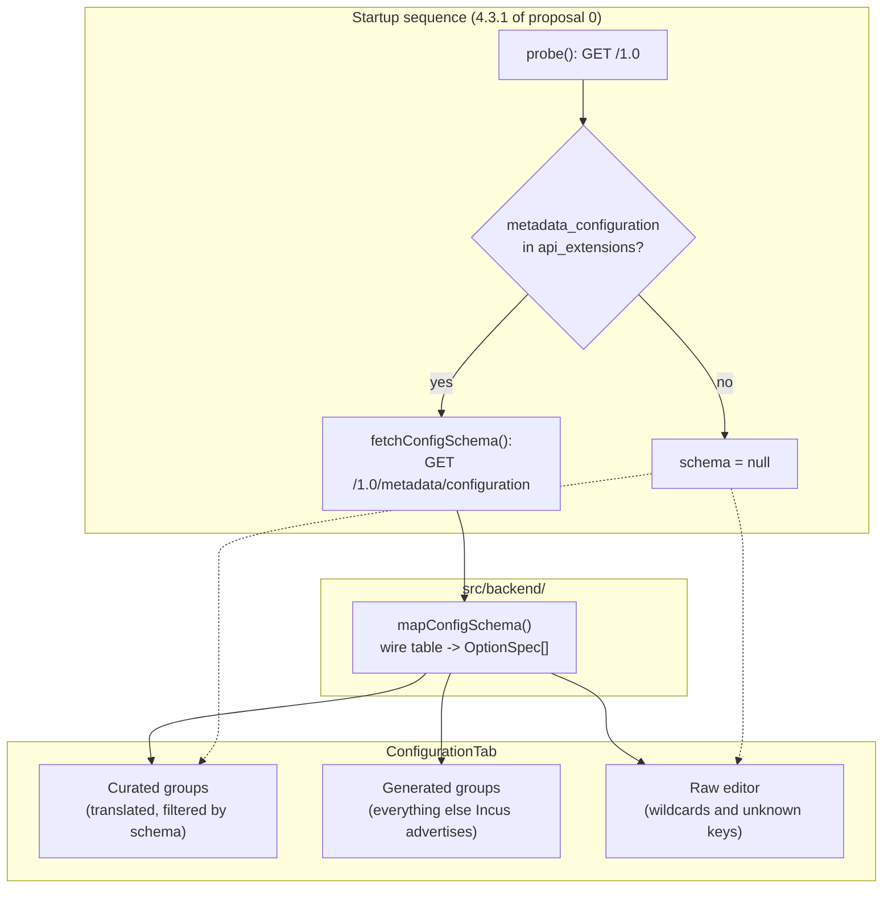

# Metadata-Driven Configuration Surface - Spec Proposal

| Item       | Detail                           |
|------------|----------------------------------|
| Author     | heavycaffeiner(Dong Hyun Kim)    |
| Created    | 2026-08-06                       |
| Status     | Draft / In Review / **Approved** |
| Reviewers  | heavycaffeiner(Dong Hyun Kim)    |

---

## 1. Summary

The instance configuration forms in `cockpit-lxc` are a hand-written list of 25 Incus
options. This proposal replaces that list as the source of truth with Incus's own option
table, fetched at runtime from `GET /1.0/metadata/configuration`, so that every option the
server advertises for containers is editable with its own documentation, and no option the
server does not have can be offered. The curated, translated fields stay as the top of the
form for the settings operators reach for most; the generated section covers the rest.

## 2. Background & Motivation

### 2.1 The gap, measured

Incus 6.23 on the verification host advertises **102 non-volatile instance options**, of
which **81 apply to system containers** once virtual-machine-only options, the OCI group
and the `raw.qemu.*` family are excluded. `src/config/fields.ts` types **25**. The
remaining 56 are reachable only through the raw key/value editor, which means the operator
must already know the key name, its accepted values and its default. That satisfies the
letter of "every setting is editable" from proposal 0, section 3.1, and not its intent.

### 2.2 A hand-written list is wrong the moment it is written

The list is not merely incomplete, it is already incorrect. `limits.network.priority` is
offered by the current form and does not exist on Incus 6.23:

```
$ incus config set web01 limits.network.priority 5
Error: Invalid config: Unknown configuration key: limits.network.priority
```

Because the configuration tab submits the whole editable half of the instance in one PUT,
a value in that field fails the entire save, including every unrelated change made in the
same edit. The operator is given a field that cannot work and an error that does not name
it.

This is the failure mode proposal 0 section 4.3.1 step 5 already identified for API
extensions, and solved by checking what the server advertises rather than assuming. The
same reasoning applies one level down, to the options themselves. Nothing about a
hand-maintained list can prevent this recurring: Incus ships monthly, and the list is
correct only until the next release that renames, removes or adds a key.

### 2.3 What the metadata endpoint provides

`GET /1.0/metadata/configuration`, gated by the `metadata_configuration` API extension
(present on the verification host, which advertises 510 extensions), returns the same
table Incus builds its own documentation from. Each option carries:

| Field         | Use                                                                    |
|---------------|------------------------------------------------------------------------|
| `type`        | `bool`, `integer`, `int64`, `string`, `blob`; picks the control        |
| `condition`   | `container`, `unprivileged container`, `virtual machine`, `oci container`, or absent; picks what to show |
| `liveupdate`  | `yes` or `no`; whether the change takes effect without a restart        |
| `shortdesc`   | One-line description, used as the field's help text                     |
| `longdesc`    | Extended description, used as expandable detail                         |
| `defaultdesc` | The default, shown so an empty field is not mistaken for zero           |

Of the 81 container-applicable options, **33 are live-updatable and 48 need a restart**.
The plugin currently tells the operator nothing about which is which, so a setting that
appears saved but has not taken effect looks like a bug in either Incus or the plugin.

## 3. Goals & Non-Goals

### 3.1 Goals

- [ ] Fetch Incus's option table once per session and expose it through the backend
      boundary as domain types, so the wire format stays behind `ContainerDriver`.
- [ ] Render every container-applicable option the server advertises, grouped as Incus
      groups them, with its own description, default and type-appropriate control.
- [ ] Hide any option whose `condition` marks it as belonging to virtual machines or OCI
      containers, so the form never offers a setting that cannot apply.
- [ ] Cross-check the curated fields against the table and hide any the server does not
      know, which closes the `limits.network.priority` class of failure permanently.
- [ ] Surface `liveupdate` on each field, so an operator knows before saving whether the
      change needs a restart, and after saving which changes are pending one.
- [ ] Keep the curated, translated fields first. Incus's descriptions are English-only, and
      demoting the settings operators use daily to an untranslated generated list would be
      a regression in every locale but one.
- [ ] Degrade to exactly today's behaviour on a server without the
      `metadata_configuration` extension: curated fields plus the raw editor, no error.
- [ ] Keep the raw key/value editor for what the table cannot express: the six wildcard
      families (`environment.*`, `user.*`, `linux.sysctl.*`, `smbios11.*`,
      `systemd.credential.*`, `systemd.credential-binary.*`) and any key a future server
      accepts but does not document.

### 3.2 Non-Goals

- [ ] Translating Incus's option descriptions. They arrive from the server in English and
      are shown as they arrive; translating 81 upstream descriptions would put the plugin
      in the position of maintaining a fork of Incus's documentation.
- [ ] Device option schemas. The table also describes device options (`devices` group),
      but the device forms are a separate surface with their own add and remove flow, and
      folding them in belongs in its own proposal.
- [ ] Profile, network and storage pool option schemas. The same table carries them, and
      the same mechanism would serve, but the scope here is the instance.
- [ ] Validating values against Incus's documented ranges. The table gives a type and a
      description, not a grammar; client-side validation stays at the level proposal 0
      section 4.3.3 specifies, with the server as the authority.
- [ ] Editing volatile keys. Incus owns them and rejects writes; they stay hidden.

## 4. Technical Design

### 4.1 Architecture Overview

The schema is fetched once, alongside the existing startup probe, and flows down to the
configuration tab beside the container it describes.



The dotted edges are the degraded path: with no schema, the curated groups render
unfiltered and the raw editor excludes only the curated keys, which is today's behaviour
exactly.

### 4.2 Data Model Changes

**No persistent schema change.** The plugin still owns no database, table or configuration
file. One in-memory addition:

```ts
/**
 * Incus's own description of one instance option, as the server advertises it.
 * Not authoritative about the container; authoritative about what may be set on it.
 */
interface OptionSpec {
    /** Full key, for example "security.nesting". Never a wildcard prefix. */
    key: string;
    /** Incus's own group name: "security", "resource-limits", "boot", and so on. */
    group: string;
    /** Drives the control: a checkbox, a number field, a text box or a textarea. */
    type: "bool" | "integer" | "string" | "blob";
    /** One-line description from the server, shown as help. English only. */
    description: string;
    /** Extended description, shown on demand. Empty when the server gives none. */
    detail: string;
    /** The default, as the server describes it. Empty when there is none. */
    defaultText: string;
    /** False when changing this needs a restart to take effect. */
    liveUpdate: boolean;
    /** True when the option only applies to an unprivileged container. */
    unprivilegedOnly: boolean;
}

/** The table, indexed for lookup and ordered for rendering. */
interface ConfigSchema {
    byKey: ReadonlyMap<string, OptionSpec>;
    /** Groups in the order they are rendered, each already filtered to containers. */
    groups: readonly { name: string; options: readonly OptionSpec[] }[];
}
```

The schema is fetched once per page load and held for the session. It does not change
while the daemon runs: it is compiled into the Incus binary.

### 4.3 Core Logic

#### 4.3.1 What is kept from the table

An option is rendered when **all** of the following hold. The rules are applied in this
order, and the first that rejects wins:

1. The key contains no `*`. A wildcard is a family, not a setting; there is no single
   value to bind a control to. The six wildcard families go to the raw editor, except
   `environment.*`, which already has a dedicated editor.
2. The group is not `volatile`. Incus owns those keys and rejects writes to them.
3. The group is not `oci`. Those apply to OCI containers, which proposal 0 section 3.2
   places out of scope.
4. The key does not start with `raw.qemu`. Those configure the QEMU process of a virtual
   machine.
5. `condition` does not contain `virtual machine`.

An option whose `condition` is `unprivileged container` is kept and flagged. It is
meaningful on the containers this plugin manages, which are unprivileged unless
`security.privileged` is set, and hiding it would remove a real setting on the strength of
a condition that is usually satisfied.

Applying these rules to Incus 6.23 leaves **81 options**: boot 7, cloud-init 6,
migration 4, miscellaneous 8, nvidia 4, raw 4, resource-limits 15, security 28,
snapshots 5.

#### 4.3.2 How the curated and generated halves divide

The curated list in `src/config/fields.ts` keeps its groups, its translated labels and
help, its placeholders and its validators, and gains one behaviour: **a curated field
whose key is absent from the schema is not rendered**. That is the whole fix for section
2.2. On a server that does not advertise `limits.network.priority`, the field does not
exist; on one that does, it does.

The generated section renders every kept option that no curated group already owns.
Ownership is by key, and `TYPED_KEYS` already enumerates it, so the two halves cannot
render the same key twice. Groups appear in Incus's own order, with Incus's own group name
as the heading, and are collapsed by default: 56 further fields expanded on arrival would
bury the curated ones that most edits touch.

#### 4.3.3 Type to control

| `type`             | Control                                                              |
|--------------------|----------------------------------------------------------------------|
| `bool`             | Select of inherited / true / false, matching the curated boolean fields |
| `integer`, `int64` | Number input                                                          |
| `string`           | Text input                                                            |
| `blob`             | Textarea, since `raw.lxc` and friends are multi-line documents        |

A boolean is a three-state select rather than a checkbox for the reason the curated fields
already use one: an unset key inherits from the profile, and a checkbox cannot express the
difference between "off" and "not set by this container". Writing `false` where the
operator meant "leave it alone" severs the container from its profile silently, which is
the failure proposal 0 section 3.1 calls out for the forms generally.

#### 4.3.4 Restart-pending state

`liveupdate: no` on an option means the value is stored immediately and applied at next
start. The tab uses this twice:

1. **Before saving**, the field carries a marker saying the change needs a restart.
2. **After saving**, if any saved key had `liveUpdate === false` and the container is
   running, the tab shows one notice naming those keys and offering a restart.

The notice is derived from what was saved rather than stored, so it does not survive a
reload and cannot go stale. This is deliberately not a persistent "pending changes" badge:
the plugin cannot know whether a restart happened outside it, and a badge that is wrong is
worse than no badge.

#### 4.3.5 The raw editor's remit narrows

Today the raw editor excludes `TYPED_KEYS`, `volatile.*`, `image.*` and `environment.*`.
It gains one more exclusion: any key present in the schema, since it now has a real field.
What remains is exactly the set nothing else can express, which is the wildcard families
and any key the server accepts but does not document. That keeps the escape hatch that
makes "all settings" literally true, without it also being the only way to reach 56
documented options.

#### 4.3.6 Failure and degradation

| Condition                                            | Behaviour                                    |
|------------------------------------------------------|----------------------------------------------|
| `metadata_configuration` absent from `api_extensions` | No fetch. Schema is null, form is today's.   |
| Fetch fails at transport or HTTP level                | Schema is null, form is today's. Not fatal.  |
| Body parses but `metadata.configs.instance` is absent | Schema is null, form is today's.             |
| A group in the table is unknown to this code          | Rendered as-is under its own name.           |
| An option `type` is unknown to this code              | Rendered as a text input.                    |

Every degradation lands on the same place: the plugin as it behaves today. The schema is
an enrichment, never a dependency, and a server that cannot describe itself must not cost
the operator the forms that already work.

## 5. API Design

### 5-1. New / Modified

#### 5-1-1. Incus endpoint consumed

| Method | Path                             | Sync/Async | Purpose                              |
|--------|----------------------------------|------------|--------------------------------------|
| GET    | `/1.0/metadata/configuration`    | sync       | The server's own option table        |

Requires the `metadata_configuration` API extension. The response envelope carries
`metadata.configs.instance`, an object of group name to `{ keys: [ { <key>: {...} } ] }`.
Note the shape: `keys` is an array of single-entry objects, not an object, so the key name
is the sole property name of each element rather than a field within it.

#### 5-1-2. Driver interface addition

```ts
/**
 * Fetch the server's own description of every instance option.
 *
 * Resolves to null rather than rejecting when the server does not advertise the
 * metadata_configuration extension, or when the table cannot be read: the
 * configuration forms work without it, and a probe that fails must not cost the
 * operator a page that would otherwise render.
 *
 * Called once per session. The table is compiled into the Incus binary and does
 * not change while the daemon runs, so there is nothing to invalidate.
 */
fetchConfigSchema(extensions: ReadonlySet<string>): Promise<ConfigSchema | null>;
```

```
FUNCTION fetchConfigSchema(extensions):
    IF "metadata_configuration" NOT IN extensions:
        RETURN null

    TRY:
        envelope <- request("/1.0/metadata/configuration")
    CATCH any:
        RETURN null

    instance <- envelope.configs.instance
    IF instance is not an object:
        RETURN null

    groups <- empty list
    FOR EACH (groupName, body) IN instance:
        options <- empty list
        FOR EACH entry IN body.keys:
            key <- the sole property name of entry
            meta <- entry[key]

            IF key CONTAINS "*":                       CONTINUE
            IF groupName IS "volatile" OR "oci":       CONTINUE
            IF key STARTS WITH "raw.qemu":             CONTINUE
            IF meta.condition CONTAINS "virtual machine": CONTINUE

            options.APPEND(OptionSpec {
                key, group: groupName,
                type: mapType(meta.type),              // int64 -> integer, unknown -> string
                description: meta.shortdesc OR "",
                detail: meta.longdesc OR "",
                defaultText: meta.defaultdesc OR "",
                liveUpdate: meta.liveupdate IS "yes",
                unprivilegedOnly: meta.condition CONTAINS "unprivileged",
            })

        IF options IS NOT EMPTY:
            groups.APPEND({ name: groupName, options })

    RETURN ConfigSchema { byKey: index of every option by key, groups }
```

#### 5-1-3. Configuration tab contract

```ts
/**
 * Curated groups, filtered by what the server actually has.
 *
 * A curated field naming a key the schema does not carry is dropped rather than
 * rendered: offering it produces a save that fails as a whole, with an error
 * that names the key but not the field it came from. With no schema every group
 * is returned unchanged, which is the behaviour before this proposal.
 */
function curatedGroups(schema: ConfigSchema | null): readonly FieldGroup[];

/**
 * Everything the server advertises that no curated group owns, in Incus's own
 * grouping. Empty when there is no schema.
 */
function generatedGroups(schema: ConfigSchema | null): readonly FieldGroup[];

/**
 * The keys saved in this edit that only take effect on restart, so the tab can
 * say so once rather than per field. Empty when the container is not running,
 * since a stopped container applies everything at its next start anyway.
 */
function restartPending(
    schema: ConfigSchema | null,
    savedKeys: readonly string[],
    running: boolean,
): readonly string[];
```

### 5-2. Error Handling

This adds no HTTP surface of its own. The errors it can produce, and what each does:

| Condition                                     | Result                                                       |
|-----------------------------------------------|--------------------------------------------------------------|
| Extension absent                              | Schema null; forms unchanged; nothing shown to the operator  |
| Transport failure on the metadata request     | Schema null; forms unchanged; nothing shown to the operator  |
| HTTP 404 or 501 on the metadata request       | Schema null; forms unchanged; nothing shown to the operator  |
| Envelope parses but has no `configs.instance` | Schema null; forms unchanged; nothing shown to the operator  |
| Unknown option `type` in the table            | Rendered as a text input; no error                            |
| Unknown group name in the table               | Rendered under that name; no error                            |
| Save rejected by Incus (400)                  | Unchanged from proposal 0 section 4.3.3: the server's message is mapped to the offending field where it names one |

The metadata failures are deliberately silent. They cost the operator nothing they had
before, and an error banner about a documentation table would be noise on a page whose
actual job still works.

## 6. Implementation Plan

### 6-1. Milestones

| Phase   | Task | Estimated Duration | Owner |
|---------|------|--------------------|-------|
| Phase 1 | **Schema transport.** `WireConfigMetadata` types, `mapConfigSchema`, `fetchConfigSchema` on the driver, extension gate, and the filtering rules of 4.3.1. Wired into the startup sequence and carried on `ServerInfo`. No UI change; verified by asserting the option count against a live server. | 2 days | heavycaffeiner |
| Phase 2 | **Curated filtering and the generated section.** `curatedGroups` drops what the server lacks. `generatedGroups` renders the rest, collapsed, one expandable section per Incus group, with type-driven controls. The raw editor's exclusion set grows to cover schema keys. | 3 days | heavycaffeiner |
| Phase 3 | **Restart-pending and polish.** `liveupdate` markers on fields, the post-save notice with a restart action, `longdesc` on demand, and the 4px grid and keyboard passes over the new controls. | 2 days | heavycaffeiner |

Each phase leaves the plugin shippable. Phase 1 changes no pixel; Phase 2 is the feature;
Phase 3 is the information that makes it honest about when a change takes effect.

### 6-2. Dependencies

- **Incus >= 6.0 with the `metadata_configuration` API extension.** Verified present on
  Incus 6.23. Absent means the degraded path of 4.3.6, not a failure.
- **No new npm dependency.** The table is JSON over the existing `cockpit.http()`
  transport, mapped by hand like every other Incus response.
- **No new Cockpit capability.** Same socket, same privilege, same envelope handling.
- Proposal 0 must be implemented first, which it is: this extends its section 4.3.3
  configuration path and its section 4.3.1 startup sequence.

## 7. References

**Incus**

- [Incus instance options](https://linuxcontainers.org/incus/docs/main/reference/instance_options/), the human-readable rendering of the same table this proposal consumes
- [Incus REST API: `/1.0/metadata/configuration`](https://linuxcontainers.org/incus/docs/main/rest-api/), the endpoint and its envelope
- [Incus API extensions](https://linuxcontainers.org/incus/docs/main/api-extensions/), for `metadata_configuration`
- [Incus instance configuration](https://linuxcontainers.org/incus/docs/main/explanation/instance_config/), for how profiles and instance-local keys combine

**This project**

- `cockpit-lxc-0-container-management-plugin.md`, sections 3.1 (every setting editable),
  4.3.1 (startup and capability detection), 4.3.3 (configuration writes and concurrency)
- `src/config/fields.ts`, the curated list this proposal keeps and filters
- `src/views/raw-config-editor.tsx`, the escape hatch whose remit this proposal narrows

**PatternFly**

- [ExpandableSection](https://www.patternfly.org/components/expandable-section), for the
  collapsed generated groups

## 8. Implementation status

All three phases are implemented and verified against Incus 6.23 on the same host as
proposal 0. The configuration tab renders **75 options in 10 groups**, which is every
instance option that server advertises for containers: 24 curated and translated, 51
generated from the table. Before this it rendered 25, one of which the server rejected.

Two things were found during implementation that the proposal did not anticipate, both
defects that predate it:

- **`getContainer` fetched no state.** A plain `GET /1.0/instances/<name>` returns the
  configuration and no `state` object, so the overview tab it feeds showed no metrics and
  no addresses however the container was running. Section 3.1 of proposal 0 claims CPU,
  memory, disk and network metrics, and none of them had ever appeared there. The fix is
  `?recursion=1`, whose ETag is byte-identical to the plain form on Incus 6.23, verified
  before relying on it, so the write precondition is unaffected. Disk now renders too, and
  says plainly that Incus reports no usage for a `dir` pool rather than showing `0 B`.
- **Four Korean strings had dropped a placeholder.** `overview.in_out` had lost its `$1`,
  so a container's network transmit rendered as nothing at all; the same fault sat in
  three other strings. It was invisible while the metrics were too broken to display.
  `build/check-catalogues.mjs` now fails on a translation whose placeholders do not match
  English, which is the gate that should have caught it. A count string was also being
  reused for a byte ratio, which put a counter suffix on megabytes; sizes have their own
  string now.
