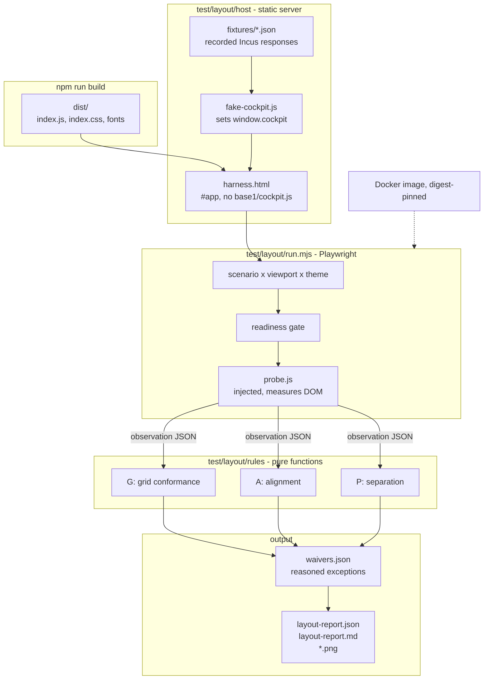

# Layout Conformance Toolchain - Spec Proposal

| Item       | Detail                           |
|------------|----------------------------------|
| Author     | heavycaffeiner(Dong Hyun Kim)    |
| Created    | 2026-08-10                       |
| Status     | **Draft** / In Review / Approved |
| Reviewers  |                                  |

---

## 1. Summary

`cockpit-lxc` enforces its 4px grid with a stylelint rule that reads length literals out of
SCSS source. That rule cannot see what the browser actually lays out, so the failures it
misses are exactly the ones that matter: a block that is correctly spaced but sits half a
step off because of an ancestor, two sections whose left edges disagree, a scroll region
whose text is flush against its border. This proposal adds a rendering-based audit that
loads the shipped bundle in a pinned headless browser, measures every visible element, and
fails CI on off-grid geometry, misaligned edges and missing separation. Findings that are
genuinely acceptable are carried in a waiver file with a written reason, so an exception is
a reviewable line in a diff rather than an unrecorded decision.

## 2. Background & Motivation

### 2.1 What is enforced today, and what it can reach

Three mechanisms exist:

| Mechanism | Where | What it sees |
|-----------|-------|--------------|
| `cockpit-lxc/four-px-grid` stylelint rule | `build/stylelint-4px-grid.js` | `px` and `rem` literals written in `src/**/*.scss`, in a fixed property list, plus custom property declarations |
| `?grid=1` overlay | `src/grid-overlay.tsx` | Nothing automatically. It paints a 4px gradient over the page for a human to look at |
| `make check` / the `check` workflow | `Makefile`, `.github/workflows/check.yml` | Runs the stylelint rule and fails on violation |

The lint rule is the only automated gate, and it is a source-text gate. Its blind spots are
structural, not incidental:

- **It never sees a resolved value.** `var(--pf-t--global--spacer--md)` passes without the
  rule knowing what it resolves to. That is deliberate and correct as far as it goes, but it
  means the rule has no opinion on PatternFly's own numbers. If a PF6 component ships a
  `6px` cell padding, every table in the plugin is off grid and the gate stays green.
- **It never sees a position.** The rule checks the length in a declaration. It cannot check
  where the box ends up, and an element's position is the sum of every spacing decision in
  its ancestor chain. This is precisely the case the `?grid=1` overlay was added for, and it
  is the case with no automation behind it.
- **It never sees a relationship.** Alignment is a property of two or more elements. No
  single declaration is wrong when a toolbar starts at 16px and the table below it starts at
  0; both values are on grid, and the page still looks broken.
- **It never sees a theme or a viewport.** The stylesheet is read once, statically. Dark
  theme changes border presence and colour tokens, and a narrow viewport changes which
  PatternFly breakpoint applies. Neither is exercised.

`src/app.scss` is written entirely in PatternFly tokens, and there are zero inline `style={{
}}` props across `src/**/*.tsx`. The stylesheet is, by the standard the lint rule can
measure, already clean. That is the point: the rule has run out of things it is capable of
catching, and the remaining defects are all in the layer it cannot reach.

### 2.2 The failure modes with no gate on them

These are the classes this proposal targets. Each is invisible to source-text linting by
construction.

1. **Accumulated half-steps.** A percentage height, a flex distribution or a fractional line
   box puts a container at a non-integer offset, and every descendant inherits the error.
   `.lxc-page { block-size: 100% }` resolves against the frame, and the frame's height is
   whatever Cockpit's shell gives it.
2. **Vendor geometry.** PatternFly 6 is a dependency with its own spacing decisions. The
   plugin's declared contract, from proposal 0 section 3.1, is that *every layout dimension
   resolves to a multiple of 4px*, not that every dimension the plugin itself wrote does.
   Nothing currently checks the difference.
3. **Edge disagreement.** Sibling blocks in the same column that do not share a start edge.
   `src/app.scss` already carries several one-off `margin-block-end` and `padding-inline-
   start` rules per view, applied to different selectors, which is the shape of code that
   drifts out of agreement.
4. **Missing separation.** Two buttons that touch, text flush against the border of a scroll
   region, a card whose content sits on its own edge. `.lxc-raw__table` carries a comment
   saying that at 4px the controls touch each other vertically, which is a defect that was
   found by eye and fixed by hand, with nothing to stop the next one.
5. **Theme-dependent shift.** A border that appears only in one theme moves everything after
   it by its width.

### 2.3 Why a rendering harness is the right instrument

The measurement this needs is `getBoundingClientRect()` on a laid-out document. There is no
static analysis that produces it, because producing it is what a browser engine does. The
alternative approaches were considered and rejected:

- **Extending the stylelint rule to resolve tokens.** It would need a CSS cascade
  implementation to know which declarations win, and a layout implementation to know where
  boxes land. That is a browser.
- **jsdom.** It does not do layout. Every rect is zero.
- **Screenshot diffing against golden images.** It answers "did this change" and not "is
  this correct". A page that was misaligned in the baseline stays misaligned forever, and
  every intentional change is a full re-baseline.

The measurement approach answers the question that was actually asked, and its findings name
the element and the number rather than pointing at a picture.

### 2.4 The injection seam already exists

The harness needs the application to render without an Incus server, and the codebase
already has the boundary that makes this cheap.

`src/backend/cockpit-runtime.ts` resolves the bare `cockpit` specifier to `window.cockpit`,
which `src/index.html` populates by loading `../base1/cockpit.js` as a classic script. The
ESLint rules in `eslint.config.js` guarantee that nothing outside `src/backend/` reads that
global by any route. So substituting a different `window.cockpit` before the bundle loads
replaces the entire outside world in one move.

This matters for two reasons. First, **no production source changes.** The audit measures
the bundle that ships, not a variant built for testing. Second, the real `IncusDriver`,
`IncusClient` and envelope parsing all run, so the rendered output is what the application
produces from a server response rather than what a hand-written prop tree produces.

`useContainers()` constructs `new IncusDriver()` directly with no injection point, which
would be an obstacle for any approach that stubbed at the driver level. Stubbing at the
transport level goes underneath it and needs nothing from it.

## 3. Goals & Non-Goals

### 3.1 Goals

- [ ] Render every view, tab, dialog and non-nominal state of the plugin in a headless
      browser from recorded fixtures, with no Incus server and no changes to `src/`.
- [ ] Measure the border-box geometry and resolved spacing of every visible element and fail
      when a position, a block size or a spacing value is not a multiple of 4px.
- [ ] Fail when sibling blocks that share a flow column do not share a start edge, when a
      view's top-level sections disagree on their content edges, or when a row's items
      contradict the cross-axis alignment their container declares.
- [ ] Fail when adjacent interactive elements have no separation outside a grouping
      component, when a bordered or scrolling box has content flush against its edge, or when
      an interactive target is smaller than 24 by 24 CSS pixels.
- [ ] Produce identical results on a developer's machine and in CI, by running both inside
      one Docker image pinned by digest.
- [ ] Run the audit across multiple viewport widths and both the light and dark themes.
- [ ] Block merge on any unwaived finding, and require every waiver to carry a written
      reason. Remove a waiver automatically from the required set when it stops matching, so
      the file cannot accumulate stale entries.
- [ ] Emit a machine-readable report, a job summary naming each finding by element and
      number, and a screenshot per failing scenario with the offending boxes outlined.

### 3.2 Non-Goals

- [ ] **Extending the static gates.** The stylelint rule stays exactly as it is, and no
      ESLint rule for inline styles or PatternFly spacing props is added. There are currently
      zero inline styles to police, and the runtime audit subsumes the question either way by
      measuring the result rather than the declaration.
- [ ] **Browser zoom levels.** Fractional device pixel ratios accumulate rounding that the
      stylesheet cannot control, and the findings would be dominated by the renderer rather
      than by the design. `deviceScaleFactor` is fixed at 1.
- [ ] **Colour, contrast and typography.** This audit is about geometry. Contrast checking is
      a separate instrument with a separate failure vocabulary.
- [ ] **Screenshot diffing.** No golden images and no perceptual comparison. Screenshots are
      produced as evidence for a numeric finding, never as the basis of one.
- [ ] **Behavioural or functional testing.** Scenarios drive the UI only far enough to reach
      a state worth measuring. Whether an action produces the right API call is out of scope.
- [ ] **Cross-browser coverage.** Chromium only. Cockpit is used across browsers, but a
      second engine multiplies the waiver file by its own rounding behaviour while the
      defects being hunted are engine-independent.
- [ ] **Inline-direction sizes.** Element widths are deliberately not checked. See section
      4.3.2 for the reasoning.

## 4. Technical Design

### 4.1 Architecture Overview

The audit is a separate tree under `test/layout/` that consumes `dist/` as a build artifact.
It imports nothing from `src/` at runtime and is imported by nothing.



The pieces, and why each is separate:

| Path | Role |
|------|------|
| `test/layout/host/harness.html` | The page under audit. A copy of `src/index.html` with `../base1/cockpit.js` and `po.js` replaced by the shim, and with `index.css` and `index.js` loaded from `dist/`. |
| `test/layout/host/fake-cockpit.ts` | Implements the `CockpitApi` surface against recorded fixtures. Bundled to an IIFE classic script by the same esbuild toolchain. |
| `test/layout/fixtures/` | Recorded Incus 6.23 responses, keyed by method and path. |
| `test/layout/scenarios.ts` | The list of states to measure and the Playwright steps that reach each one. |
| `test/layout/probe.ts` | Runs inside the page. Walks the DOM and returns one flat observation array. Contains no rule logic. |
| `test/layout/rules/` | Pure functions from an observation array to findings. No browser, no I/O, unit-testable on recorded observations. |
| `test/layout/waivers.json` | Reasoned exceptions. |
| `test/layout/run.mjs` | Orchestrates the matrix, applies rules, reconciles waivers, writes the report. |
| `test/layout/Dockerfile` | The pinned environment. |

The separation between `probe.ts` and `rules/` is the load-bearing one. Measurement happens
once per render and is expensive; rule evaluation is pure and cheap. Keeping them apart means
a rule can be changed and re-run against stored observations without launching a browser, and
a rule can be unit-tested with a hand-written observation array.

### 4.2 Data Model Changes

No database and no schema. The audit introduces four on-disk formats.

#### 4.2.1 Fixture

One file per endpoint response under `test/layout/fixtures/`, named by method and path with
slashes replaced by underscores, for example `GET_1.0_instances_recursion=1.json`. Content is
the Incus response body verbatim, envelope included. A companion `index.json` maps the
request key to the file and carries the HTTP status:

```json
{
  "GET /1.0": { "status": 200, "body": "GET_1.0.json" },
  "GET /1.0/instances?recursion=1": { "status": 200, "body": "GET_1.0_instances.json" },
  "GET /1.0/metadata/configuration": { "status": 200, "body": "GET_1.0_metadata.json" }
}
```

Fixtures are recorded once from a live Incus 6.23 host and edited to be deterministic: fixed
container names, fixed absolute timestamps, fixed metric values, fixed image fingerprints.
Anything that would vary run to run is a source of geometry flake, because a longer string is
a wider box.

#### 4.2.2 Observation

What `probe.ts` returns, one entry per audited element. This is the interface between the
browser and every rule, so it is the one shape that has to be complete.

```ts
interface Observation {
    /** Stable index into the observation array. Parents always precede children. */
    id: number;
    /** id of the nearest audited ancestor, or null for a root. */
    parent: number | null;
    /** A CSS path good enough to find the element again by hand. */
    selector: string;
    tag: string;
    /** Border-box rect relative to the document origin, not the viewport. */
    rect: { top: number; left: number; width: number; height: number };
    /** Content-box inset from the border box, in the order block-start, inline-end, block-end, inline-start. */
    padding: [number, number, number, number];
    margin: [number, number, number, number];
    border: [number, number, number, number];
    /** null when the element is not a flex or grid container. */
    gap: { row: number; column: number } | null;
    display: string;
    position: string;
    flexDirection: string | null;
    alignItems: string | null;
    justifyContent: string | null;
    /** True for elements that receive pointer or keyboard interaction. */
    interactive: boolean;
    /** True when the element establishes a scroll container. */
    scrollable: boolean;
    /** True when the element directly contains a non-empty text node. */
    hasText: boolean;
}
```

#### 4.2.3 Finding

```ts
interface Finding {
    rule: "G1" | "G2" | "G3" | "A1" | "A2" | "A3" | "P1" | "P2" | "P3";
    scenario: string;
    viewport: string;
    theme: "light" | "dark";
    selector: string;
    /** Human-readable statement of what was measured against what was required. */
    detail: string;
    /** The measured number, used for waiver matching. */
    value: string;
    rect: { top: number; left: number; width: number; height: number };
}
```

#### 4.2.4 Waiver

```json
{
  "version": 1,
  "waivers": [
    {
      "rule": "G3",
      "scenario": "containers/list",
      "selector": ".pf-v6-c-table tbody td",
      "value": "padding-inline-start: 6px",
      "reason": "PatternFly 6.6 sets a 6px cell inline padding. Overriding it to 8px would put every table in the plugin out of step with Cockpit's own pages, which is the failure the grid rule exists to prevent.",
      "owner": "heavycaffeiner"
    }
  ]
}
```

`scenario` accepts `*` as a trailing wildcard. `viewport` and `theme` are omitted to mean any.
`reason` is mandatory, must be at least 40 characters, and must not be `TODO`. The runner
rejects the file otherwise, which is what stops a generated baseline from being merged
unexamined.

### 4.3 Core Logic

#### 4.3.1 Rendering a scenario

The sequence for one cell of the matrix, in order, with the reason each step exists:

1. **Launch a browser context** with `deviceScaleFactor: 1`, `reducedMotion: "reduce"`,
   `colorScheme` set from the matrix cell, and `viewport` set from the matrix cell. Every
   viewport width is a multiple of 4, so that a full-width child of the page is not off grid
   for a reason that has nothing to do with the stylesheet.
2. **Freeze the clock** with `page.clock.setFixedTime()` at a constant instant. Snapshot and
   log views render timestamps, and a relative label that ticks over from `2 minutes ago` to
   `3 minutes ago` changes the width of its box.
3. **Seed `localStorage`** with `shell:style = "auto"`, so `src/theme.ts` falls through to
   `prefers-color-scheme`, which the context's `colorScheme` controls. This is how the dark
   theme is selected without touching production code or simulating a Cockpit shell event.
4. **Navigate to `harness.html`.** The classic script tag for `fake-cockpit.js` runs before
   the deferred `index.js`, matching the ordering contract `src/index.html` documents.
5. **Disable transitions and animations** by adding a stylesheet that zeroes their durations.
   Transitions do not affect final layout, so this changes no measurement; it removes the
   window in which a measurement could be taken mid-flight.
6. **Await `document.fonts.ready`.** PatternFly's web fonts are bundled into `dist/` by the
   esbuild file loader, so they load from the same origin and are deterministic, but text
   measured before they swap is measured in a fallback face.
7. **Run the scenario's steps**, which are ordinary Playwright interactions: switch to a tab,
   open a dialog, expand a section.
8. **Wait for readiness**, defined in 4.3.6.
9. **Inject and run `probe.ts`**, collecting the observation array.
10. **Evaluate the rules**, collect findings, and if there are any, outline them and take a
    full-page screenshot.

#### 4.3.2 The audit set

A rule that fires on every node in the document produces noise, so membership is defined
first and defended.

An element is **audited** when all of the following hold:

- It is inside `document.body` and is not part of the harness itself. Harness-injected nodes
  carry `data-lxc-audit-harness` and are skipped along with their subtrees. This admits
  PatternFly modals and popovers, which portal to `body` rather than into `#app`.
- Its rect has non-zero width and height, its computed `visibility` is not `hidden`, and its
  `display` is not `none`.
- Its computed `display` is not `inline`. An inline box is a line box, its geometry is
  decided by font metrics rather than by any spacing declaration, and requiring it to land on
  a 4px grid is a category error.
- It is not inside an excluded subtree. Exclusions live in `test/layout/config.json` as a
  selector list, not as attributes in `src/`, so that production code is not annotated for
  the benefit of a test. Two entries are excluded from the outset:
  - `svg` and its descendants. Icon internals are drawings, not layout.
  - `.lxc-terminal__viewport .xterm-screen` and below. xterm computes its own cell geometry
    from font metrics and reports a fractional cell height, which `src/app.scss` already
    handles by sizing the viewport itself in whole 4px steps. The container is audited; its
    canvas internals are not.

**Widths are not checked, on any element.** A width is very often a share of a container:
`inline-size: 100%`, a flex `flex: 1`, a table column's computed share. A share of an odd
container is odd, and no author decision produced it. A position, by contrast, is the sum of
the padding, margin and gap decisions made above the element, which is exactly what the 4px
rule is a rule about. Checking positions and block sizes catches the defect; checking widths
would produce a waiver file longer than the stylesheet.

**Tolerance is 0.05px.** Chromium's layout unit is 1/64px, so an exactly-on-grid value can be
reported as 15.984375. One tolerance of three layout units absorbs that quantization and
nothing else: the smallest real defect this proposal is about is a 2px half-step, which is 40
times the tolerance. The tolerance exists for float representation, not to paper over
renderer differences; that is what the pinned image in 4.3.7 is for.

#### 4.3.3 Rule group G: grid conformance

**G1, position.** For every audited element, `rect.top` and `rect.left`, measured from the
document origin, are multiples of 4px.

This is the rule the `?grid=1` overlay was built to make visible by eye. It fires on the
accumulated half-step: an element whose own declarations are all token-valued but whose
ancestor chain has put it off the baseline. `rect.left` covers the inline-direction case,
where the offset is the sum of ancestor inline padding and is fully author-controlled even
though the element's own width is not.

**G2, block size.** For every audited element, `rect.height` is a multiple of 4px.

Block size is content plus token padding plus borders, all author-controlled. It is also
where a bad line height surfaces: proposal 0 section 4.3.7 states that line heights must snap
to 4px, and a text element whose height is 22px is the observable consequence of a line
height that does not. Borders are included in the border-box height, so a bordered box whose
content is on grid reports 2px over. That is a real finding under this rule and the correct
response is usually a waiver naming the border, which is what makes the decision visible.

**G3, resolved spacing.** For every audited element, each of the four `padding` values, the
four `margin` values, and both `gap` values is either 0 or a multiple of 4px.

This is the rule that reaches what stylelint cannot. `var(--pf-t--global--spacer--md)` is
opaque to source-text analysis and resolves to a number here. Negative margins are compared
by absolute value. This rule is the one expected to seed the most waivers on first run,
because it audits PatternFly's numbers as well as the plugin's, and that is the intent: the
contract in proposal 0 is about what the page does, not about who wrote the declaration.

#### 4.3.4 Rule group A: alignment

**A1, sibling start edges.** Given an audited element, take its audited children that are in
normal flow, meaning `position` is `static` or `relative`, and that are laid out in a block
column, meaning the parent's `display` is `block` or `flow-root`, or is a flex container with
`flex-direction: column`. Every such child must have the same `rect.left`, within tolerance.

The comparison is equality between siblings, not conformance to the grid. Two siblings at
16px and 24px are both on grid and still misaligned, and that is the defect this catches. The
rule reports the majority edge as expected and names the minority members as findings, so a
column of eight blocks with one stray produces one finding rather than eight.

Children with a non-`static`/`relative` position are excluded because an absolutely positioned
element is deliberately out of the column. Row-direction flex children are excluded because
their start edges are supposed to differ.

**A2, section edges.** The direct audited children of a view's content root, which is
`.pf-v6-c-tab-content` for a tabbed page and the page section otherwise, must share both a
start edge and an end edge.

A1 already covers the start edge for these elements as a special case. A2 adds the end edge,
because a view's top-level blocks are the ones where an inconsistent right margin is most
visible: a toolbar that stops short of the table under it reads as a mistake at a glance. The
end edge is checked only at this level, and not by A1 generally, for the reason given in
4.3.2: below the section level, an element's end edge is usually a consequence of its width.

**A3, cross-axis agreement.** For an audited element that is a flex container with
`flex-direction: row` or `row-reverse`, its audited children must agree geometrically with
its declared `align-items`:

| `align-items` | Required |
|---------------|----------|
| `flex-start`, `start` | equal `rect.top` |
| `flex-end`, `end` | equal `rect.top + rect.height` |
| `center` | equal `rect.top + rect.height / 2` |
| `stretch`, `baseline`, `normal` | not checked |

`stretch` is not checked because a child with its own block size legitimately opts out of it.
`baseline` is not checked because verifying it requires measuring text baselines through
`Range.getClientRects`, which is a materially larger piece of machinery than the defect
justifies. The rule as written covers `.lxc-terminal__bar`, `.lxc-imagestore__row`,
`.lxc-rowactions` and `.lxc-bulk`, all of which declare `align-items: center` in
`src/app.scss` today, and catches the case where one item in such a row sits high because it
carries a stray margin.

The tolerance for A3 `center` is 0.5px rather than 0.05px, because a centred item with an odd
height rounds by half a pixel through no fault of anyone.

#### 4.3.5 Rule group P: separation

**P1, adjacent interactive targets.** Two audited elements are **interactive** when they
match `button, a[href], input, select, textarea, [role="button"], [role="link"],
[role="checkbox"], [role="switch"], [tabindex]:not([tabindex="-1"])`, and neither contains the
other.

Two interactive elements are **adjacent** when their rects overlap on one axis by at least
50% of the smaller extent, and their gap on the other axis is less than 8px. Every adjacent
pair is a finding unless both elements share a nearest common ancestor that matches the
grouping allow-list in `config.json`, seeded with `.pf-v6-c-button-group`,
`.pf-v6-c-toggle-group`, `.pf-v6-c-input-group`, `.pf-v6-c-menu` and `.pf-v6-c-select__menu`.

8px is two grid steps and is the smallest separation the PatternFly spacer scale offers above
`xs`. The grouping allow-list exists because zero separation is the correct design inside a
segmented control or an input group, where the components read as one control precisely
because they touch. The overlap threshold is what stops the rule firing on two buttons that
are merely near each other diagonally.

**P2, edge flushness.** For an audited element that is `scrollable`, or that has any non-zero
border width, or that matches `.pf-v6-c-card`: on each of the four sides, the distance from
that element's padding-box edge to the nearest edge of any audited in-flow child must not be
0.

The distance is measured to the padding box, so the element's own padding satisfies the rule
directly, and a child's margin satisfies it equally. Either is a legitimate way to provide
the separation, and the rule is about the result. The failure this catches is log text
touching the border of `.lxc-logs__body`, or a card whose first child sits on its top edge.

An element with no audited in-flow children is skipped rather than passed, because an empty
box has nothing to be flush against.

**P3, target size.** Every interactive element has `rect.width >= 24` and `rect.height >= 24`.

24 CSS pixels is six grid steps and the minimum target size in WCAG 2.2 at level AA. An
interactive element below it is, in practice, an element that was not given padding, which
makes this the same defect as P1 and P2 seen from the element's own side rather than from the
space around it. Elements that are inline within a paragraph of text are excluded, because
`display: inline` already excludes them from the audit set by 4.3.2.

#### 4.3.6 Readiness, and why it is not a fixed wait

Measuring a page mid-render produces findings that are true of a transient state and false of
the page. A fixed `waitForTimeout` is both slower than necessary and unreliable under CI load.

Readiness is defined as all four of:

1. No element matching `.pf-v6-c-spinner` is present. The application renders a
   `Bullseye`-wrapped `Spinner` while `useContainers()` resolves, so its absence is the
   application's own statement that it has data.
2. `document.fonts.ready` has resolved.
3. Two consecutive animation frames produce byte-identical observation arrays. This is the
   general case and covers anything the first two conditions do not model, including xterm's
   fit addon resizing the terminal after its container settles.
4. The scenario's own `expect` selector, if it declares one, is visible. A scenario that opens
   a dialog names the dialog, so a step that silently failed to open it is a timeout with a
   clear message rather than a clean measurement of the wrong page.

Failure to reach readiness within 15 seconds fails the scenario. It is never retried: a flaky
readiness condition is a defect in the harness, and retrying it would hide the defect while
leaving the flake in place.

#### 4.3.7 Determinism

Every input that could change a measured number is pinned.

| Input | How it is pinned |
|-------|------------------|
| Browser engine and version | Playwright's own Docker image, referenced by `sha256` digest in `test/layout/Dockerfile` |
| Font faces and rasterization | The same image. PatternFly's fonts are bundled into `dist/` by the esbuild file loader, so they are served from the harness origin and never fetched |
| Device pixel ratio | `deviceScaleFactor: 1` |
| Viewport | Explicit per matrix cell, always a multiple of 4 wide |
| Clock | `page.clock.setFixedTime()` |
| Server data | Recorded fixtures, with all varying fields replaced by constants |
| Animation state | Transitions and animations zeroed, `reducedMotion: "reduce"` |
| Locale | The harness omits `po.js` entirely. English is bundled, so `src/backend/i18n.ts` falls back to it, and no host locale reaches the page |

The npm `@playwright/test` version and the image digest must agree, because a runner script
built against one API talking to browsers from another is a class of failure with a confusing
symptom. `build/check-version.mjs` already exists to stop exactly this kind of skew for the
release version across `package.json`, the `Makefile`, the spec, the changelog and the
PKGBUILD. It gains one more pair: the `@playwright/test` version in `package.json` must equal
the `v<version>` tag recorded alongside the digest in `test/layout/image.json`.

#### 4.3.8 The matrix

**Viewports**, three, all multiples of 4 wide:

| Name | Size | Why |
|------|------|-----|
| `narrow` | 768 x 1024 | PatternFly's `md` breakpoint. The width at which toolbars wrap and the container table drops columns |
| `default` | 1280 x 800 | A 1536px browser window with Cockpit's shell sidebar open. The common case |
| `wide` | 1600 x 900 | Where fixed-width controls such as `.lxc-remote-picker` at 360px and `.lxc-search` at 320px stop being the constraint and the flex distribution around them takes over |

**Themes**, two: `light` and `dark`.

**Scenarios**, one per state worth measuring. The initial set follows `src/views/`:

`containers/list`, `containers/list-empty`, `containers/list-selected`, `containers/degraded`,
`containers/create-dialog`, `detail/overview`, `detail/configuration`,
`detail/configuration-generated-expanded`, `detail/configuration-raw`, `detail/devices`,
`detail/snapshots`, `detail/logs`, `detail/terminal`, `images/list`, `images/remote-catalogue`,
`profiles/list`, `networks/list`, `storage/list`, `startup/failure`, `startup/no-admin`.

Twenty scenarios by three viewports by two themes is 120 renders. With Playwright's default
worker count on a two-core GitHub runner and a warm context per worker, this is a few minutes,
which is why it is a separate CI job rather than a step inside the existing one.

The non-nominal scenarios are in the initial set deliberately. An empty state, a degraded
alert and a startup failure are the pages least often looked at by hand and therefore the ones
most likely to be misaligned.

#### 4.3.9 Waiver reconciliation

After rules produce findings, the runner partitions them:

1. Each finding is matched against each waiver on `rule`, `scenario` (trailing `*` allowed),
   `selector` (matched by `Element.matches` against the finding's element, evaluated in the
   page), `value` (exact string), and `viewport`/`theme` when the waiver names them.
2. A finding with at least one match is **waived** and does not fail the run.
3. A waiver that matched nothing in the entire run is **unused**, and the run fails.
4. A waiver with a missing, short or `TODO` reason fails the run before any browser launches.

Rule 3 is what makes the file self-cleaning. Without it, waivers accumulate: a defect gets
fixed, its waiver stays, and years later nobody can tell which entries describe live
constraints. With it, fixing a defect breaks the build until its waiver is deleted, and the
deletion is one line in the same commit as the fix.

`node test/layout/run.mjs --update-waivers` regenerates the file from the current findings
with `reason: "TODO"` on every new entry. Because a `TODO` reason is a hard failure, the
generated file cannot be merged; it is a starting point that forces each entry to be read and
justified, which is the adoption path for the first run and for any PatternFly upgrade.

#### 4.3.10 Reporting

Three artifacts, produced whether the run passes or fails:

- **`layout-report.json`.** Every finding, plus the waived set, plus the matrix that ran and
  the image digest that ran it.
- **`layout-report.md`.** Written to `$GITHUB_STEP_SUMMARY` in CI. One table per rule group,
  each row naming the scenario, the viewport, the theme, the selector and the measured value
  against the requirement. A reader learns what is wrong without opening a log or a picture.
- **`screenshots/<scenario>-<viewport>-<theme>.png`.** Produced only for cells with unwaived
  findings. Before the capture, the runner injects one absolutely positioned outline element
  per finding, each carrying `data-lxc-audit-harness` so a re-probe would ignore it. Full-page
  rather than viewport, because a finding below the fold is otherwise a picture of the top of
  the page.

Screenshots are evidence attached to a number, never the number itself. Nothing in the pass or
fail decision reads a pixel.

## 5. API Design

### 5-1. New / Modified

This is a tooling addition. There is no REST surface and no change to `ContainerDriver`. The
signatures below are the seams between the pieces in 4.1.

#### 5.1.1 The transport shim

```ts
// test/layout/host/fake-cockpit.ts

/**
 * Install a fixture-backed `window.cockpit`.
 *
 * Typed as CockpitApi from src/types/cockpit.d.ts rather than as a structural
 * approximation. That file is the plugin's hand-maintained declaration of the
 * base1 surface, so typing the shim against it makes `npm run typecheck` the
 * thing that keeps the two in step: a method the plugin starts calling fails to
 * compile here until the shim answers it.
 *
 * Every unmatched request rejects rather than resolving empty. A missing fixture
 * that resolved to `{}` would render an empty page that passes every geometry
 * rule, which is the one failure mode this harness must not have.
 */
export const installFakeCockpit = (index: FixtureIndex): void;

interface FixtureIndex {
    /** Keyed by "<METHOD> <path>", including the query string. */
    readonly [request: string]: { status: number; body: string };
}
```

Pseudocode for the members the plugin actually calls, taken from the assertion list in
`src/backend/cockpit-runtime.ts`:

```
http(options):
    return {
        request(spec):
            key = spec.method + " " + spec.path
            entry = index[key]
            if entry is absent:
                reject with a message naming key and the fixture directory
            if entry.status >= 400:
                reject with a shape matching cockpit's http error, carrying status
            resolve with the recorded body text
        close(reason):
            no-op
    }

channel(options):
    // The terminal tab. Emits a fixed banner and prompt on the next tick so the
    // xterm viewport has deterministic content, then stays silent.
    return an EventTarget-shaped object that dispatches "ready" then one "message",
           and answers send() and close() as no-ops

spawn(argv, options):
    // `incus monitor` in src/backend/incus/events.ts. Never emits, so the list
    // never refetches mid-measurement. The `degraded` scenario is reached by
    // failing this call instead, which is what src/hooks/use-containers.ts turns
    // into the degraded banner.
    return a promise-like with stream(), then(), catch() and close()

permission(options):
    // `allowed` is null until the transport answers, and src/backend/permission.ts
    // documents that null must not be read as denied. The shim answers on the next
    // tick with the scenario's value, so the startup/no-admin scenario exercises
    // the real transition rather than a synthetic initial state.
    return an EventTarget with `allowed`, addEventListener and close

transport: { host: "localhost" }
language: "en"
```

#### 5.1.2 The probe

```ts
// test/layout/probe.ts

/**
 * Measure the document. Runs inside the page via page.evaluate.
 *
 * Returns a flat array in document order, parents before children, so a rule can
 * resolve a parent by index without a second pass. Contains no thresholds and no
 * rule logic: everything a rule needs to decide is in the returned data, so rules
 * stay pure and testable without a browser.
 */
export const probe = (config: ProbeConfig): Observation[];

interface ProbeConfig {
    /** Subtrees excluded from the audit set, as CSS selectors. */
    readonly excludeSelectors: readonly string[];
    /** Selectors whose descendants may touch without separation. */
    readonly groupingSelectors: readonly string[];
}
```

```
probe(config):
    result = []
    walk(document.body, parentId = null)
    return result

walk(element, parentId):
    if element matches "[data-lxc-audit-harness]" or any config.excludeSelectors:
        return                              // skip the subtree, not just the node
    audited = isAudited(element)
    id = parentId
    if audited:
        id = result.length
        result.push(observe(element, parentId))
    for child in element.children:
        walk(child, id)                     // id, not parentId, so `parent` is the
                                            // nearest audited ancestor and not the
                                            // nearest DOM ancestor

isAudited(element):
    style = getComputedStyle(element)
    rect  = element.getBoundingClientRect()
    return rect.width > 0 and rect.height > 0
       and style.visibility != "hidden"
       and style.display not in {"none", "inline"}

observe(element, parentId):
    rect = element.getBoundingClientRect()
    return {
        rect: { top:  rect.top  + window.scrollY,     // document-relative, so a
                left: rect.left + window.scrollX,     // scrolled page measures the
                width: rect.width, height: rect.height },  // same as an unscrolled one
        ... resolved padding, margin, border, gap from getComputedStyle
        interactive: element matches the interactive selector list,
        scrollable:  overflowX or overflowY in {"auto", "scroll"},
        hasText:     some child node is a Text node with non-whitespace content,
    }
```

#### 5.1.3 The rules

Every rule has one shape, which is what lets `run.mjs` treat them as a list.

```ts
// test/layout/rules/index.ts

/**
 * A rule reads observations and returns findings. Pure: same input, same output,
 * no clock, no filesystem, no browser. This is what makes a rule unit-testable
 * against a hand-written observation array and re-runnable against stored
 * observations without paying for a render.
 */
type Rule = (
    observations: readonly Observation[],
    context: { scenario: string; viewport: string; theme: "light" | "dark" },
) => Finding[];

export const RULES: Readonly<Record<string, Rule>>;
```

```
G1(observations, ctx):
    for each o in observations:
        for each edge in [o.rect.top, o.rect.left]:
            if not onGrid(edge):
                emit finding naming the axis, the measured value and the nearest
                two multiples of 4

onGrid(value):
    r = abs(value mod 4)
    return r < 0.05 or abs(r - 4) < 0.05

A1(observations, ctx):
    for each parent p in observations:
        children = observations where parent == p.id
                   and position in {"static", "relative"}
                   and p is a block column container
        if children.length < 2: continue
        edges = children grouped by round(rect.left / 0.05)
        majority = the largest group, ties broken by the smallest left value
        for each child not in majority:
            emit finding naming the child's left, the majority left and the
            majority's member count

P1(observations, ctx):
    targets = observations where interactive
    for each unordered pair (a, b) in targets:
        if a contains b or b contains a: continue
        if not overlapsOnOneAxis(a, b, 0.5): continue
        gap = separation along the other axis
        if gap >= 8: continue
        if nearestCommonAncestor(a, b) matches config.groupingSelectors: continue
        emit finding naming both selectors and the measured gap
```

#### 5.1.4 The runner

```ts
// test/layout/run.mjs

/**
 * Entry point. Exits 0 when every finding is waived, 1 otherwise.
 *
 * --update-waivers rewrites waivers.json from the current findings with a TODO
 * reason on each new entry, and always exits 1: a generated baseline is not a
 * passing run.
 * --scenario <glob> and --viewport <name> narrow the matrix for local iteration.
 * They are refused when CI is set, so a narrowed matrix cannot pass for a full one.
 */
```

#### 5.1.5 Build and CI targets

```
package.json:
  "check:layout": "node test/layout/run.mjs"
  "build:harness": "node test/layout/build-host.mjs"

Makefile:
  check-layout: build            # depends on dist/, runs the pinned image
      docker run --rm \
          --user $(id -u):$(id -g) \
          -e HOME=/tmp \
          -v $(CURDIR):/work -w /work \
          $(LAYOUT_IMAGE) \
          sh -c "npm run build:harness && npm run check:layout"
```

`make check` is deliberately **not** changed to depend on `check-layout`. `make dist` depends
on `check`, and `make dist` is what the rpm, deb and Arch package builds run. Adding a Docker
requirement to that path would make the plugin unbuildable on any machine or build service
without a container runtime, which is a real cost paid for no gain: the packaging build is not
where a layout regression should be discovered. CI runs both targets, which is where it should
be discovered.

The `--user` flag and `HOME=/tmp` are there so the report and screenshots are written owned by
the invoking user rather than by root. Without them, a local `make check-layout` leaves
root-owned files in the working tree that the next `npm ci` cannot remove.

#### 5.1.6 The CI job

A new `layout` job in `.github/workflows/check.yml`, alongside `check` rather than inside it:

```yaml
layout:
  runs-on: ubuntu-latest
  # No Node matrix. The audit measures rendered geometry, which the interpreter
  # that produced the bundle cannot change. Running it twice would double the
  # slowest job in the workflow to re-measure identical pixels.
  container:
    image: mcr.microsoft.com/playwright:v1.58.0-noble@sha256:<digest>
  steps:
    - uses: actions/checkout@v7
    - run: npm ci
    - run: npm run build
    - run: npm run build:harness
    - run: npm run check:layout
    - if: always()
      uses: actions/upload-artifact@v7
      with:
        name: layout-report
        path: |
          test/layout/layout-report.json
          test/layout/layout-report.md
          test/layout/screenshots/
        retention-days: 14
```

`if: always()` on the upload is the point of the job. A failing run is exactly when the
screenshots and the report are wanted, and the default would drop them.

### 5-2. Error Handling

No HTTP surface, so the table lists the conditions the toolchain itself raises. Each is a
non-zero exit with a message naming the cause.

| Condition | Behaviour |
|-----------|-----------|
| A request has no matching fixture | The shim rejects with the request key and the fixture directory path. The scenario fails. It never resolves empty, because an empty page passes every geometry rule and would report a green run for a broken harness |
| A fixture file is missing or is not valid JSON | The runner fails before launching a browser, naming the file |
| The application renders its startup-failure or error state in a scenario that did not ask for one | The scenario fails and the report carries the visible message. Catches a fixture that is well-formed but semantically wrong |
| Readiness is not reached within 15s | The scenario fails, naming which of the four conditions was outstanding. Never retried |
| A scenario step fails, for example a dialog trigger that no longer matches | Playwright's own timeout, reported against the scenario and the step index |
| The probe returns zero observations | Hard failure. Means the audit set is misconfigured or the page did not mount, and a rule pass over an empty array is vacuously green |
| `waivers.json` is unparsable, or an entry is missing `rule`, `scenario`, `selector`, `value` or `reason` | The runner fails before launching a browser |
| A waiver's `reason` is shorter than 40 characters or equals `TODO` | Same. This is what makes `--update-waivers` output unmergeable |
| A waiver matched nothing during the run | The run fails, listing the unused entries and stating that a fixed defect requires deleting its waiver |
| The `@playwright/test` version and the pinned image tag disagree | `npm run check:version` fails, in the existing `check` job, before the layout job's cost is paid |
| The Docker image digest does not resolve | `make check-layout` fails at `docker run`. Not retried and not fallen back to an unpinned tag, because an unpinned run produces numbers that cannot be compared to anyone else's |
| Screenshot or report write fails | Non-zero exit. Findings are printed to stdout first, so the diagnosis survives a full disk |

## 6. Implementation Plan

### 6-1. Milestones

Each phase ends with something runnable and verifiable on its own, so a phase can be reviewed
and merged without the ones after it.

| Phase   | Task | Estimated Duration | Owner |
|---------|------|--------------------|-------|
| Phase 1 | **The harness renders.** Record Incus 6.23 fixtures for the endpoints `IncusDriver` calls. Write `fake-cockpit.ts` typed against `src/types/cockpit.d.ts`, `harness.html`, and `build-host.mjs` to bundle the shim. Implement the readiness gate from 4.3.6. Stand up `scenarios.ts` with the twenty scenarios and no rules. Deliverable: `npm run check:layout` loads every scenario in a local Chromium, reaches readiness, screenshots each, and measures nothing. This is where a fixture that renders the wrong page is found. | 4 days | heavycaffeiner |
| Phase 2 | **Measurement and the G rules.** Implement `probe.ts` and the audit-set definition in 4.3.2. Implement G1, G2 and G3, the tolerance, and the waiver reconciliation in 4.3.9 including the unused-waiver failure. Run `--update-waivers` and write a reason for every entry, which is the first real audit of the plugin's geometry. Deliverable: the grid gate passes with a fully reasoned baseline, and a deliberately introduced `padding: 10px` fails it. | 4 days | heavycaffeiner |
| Phase 3 | **The A rules.** Implement A1, A2 and A3, including majority-edge reporting so one stray sibling is one finding. Extend the baseline with reasons for anything they surface. Deliverable: alignment findings appear in the report, and a deliberately shifted section fails the gate. | 3 days | heavycaffeiner |
| Phase 4 | **The P rules.** Implement P1 with the grouping allow-list, P2 and P3. Seed `config.json` with the PatternFly grouping selectors. Deliverable: separation findings appear, and two deliberately touching buttons outside a button group fail the gate. | 3 days | heavycaffeiner |
| Phase 5 | **Pinning and CI.** Write the `Dockerfile` and pin the digest. Add `image.json`, extend `build/check-version.mjs` to compare it against `@playwright/test`. Add the `check-layout` Makefile target with the uid mapping. Add the `layout` job and the artifact upload. Reconcile any waiver that differs between the local run and the container run, which is where a font or renderer assumption is found. Deliverable: a PR with an off-grid change is blocked by CI with a named finding and an outlined screenshot. | 3 days | heavycaffeiner |
| Phase 6 | **The matrix and the report.** Expand from one viewport and one theme to the three-by-two matrix in 4.3.8. Implement the outlined screenshots and the `$GITHUB_STEP_SUMMARY` report. Triage every waiver the new cells produce. Document the toolchain in `CONTRIBUTING.md`, including how to read a finding and what a waiver reason must say. Deliverable: the full matrix is green with no `TODO` reason in the file. | 3 days | heavycaffeiner |

Phase 2 and Phase 6 carry the schedule risk, and for the same cause: nobody knows how many
findings the first full run produces until it is run. If G3 surfaces widespread PatternFly
spacing that is off grid, the triage is larger than the implementation, and the outcome may be
that G3 needs a documented allowance for vendor component internals rather than a waiver per
selector. That decision is deferred to the data rather than guessed at here.

### 6-2. Dependencies

**New development dependencies:**

| Package | Why |
|---------|-----|
| `@playwright/test` | Browser automation, the context options in 4.3.1, `page.clock` for the fixed clock, and worker-level parallelism across the matrix |

No production dependency is added, and `dist/` is byte-identical before and after this
proposal. Playwright is the only new package: the runner, the report writer and the fixture
server are Node standard library, matching the existing scripts in `build/`.

**Container image:** `mcr.microsoft.com/playwright:v<version>-noble`, referenced by digest.
The version tag must match the `@playwright/test` version, enforced by `check:version`.

**Infrastructure:** GitHub Actions `ubuntu-latest`, which provides Docker. No self-hosted
runner and no external service.

**Node floor:** the existing `check` job matrix of Node 20 and 24 is untouched. The layout job
runs inside the Playwright image and uses whatever Node that image ships, which is not a
constraint on the plugin: the audit consumes `dist/` as an artifact and never executes plugin
source under Node.

**Repository changes outside `test/layout/`:**

- `.gitignore` gains `test/layout/.host/`, `test/layout/screenshots/` and
  `test/layout/layout-report.*`.
- `package.json` gains two scripts and one devDependency.
- `Makefile` gains the `check-layout` target and the `LAYOUT_IMAGE` variable. The `dist`
  target's file list already includes `test`, so the harness ships in the source tarball
  without a change there.
- `build/check-version.mjs` gains the Playwright version and image tag comparison.
- `.github/workflows/check.yml` gains the `layout` job.

**Upstream coupling:** a PatternFly 6 minor upgrade can change component geometry and
invalidate waivers in both directions. This is a cost of the design and is accepted: a
PatternFly upgrade that silently moves every table cell is exactly the change worth being told
about, and the unused-waiver failure means the upgrade PR carries the reconciliation rather
than deferring it.

## 7. References

- [`docs/proposals/cockpit-lxc-0-container-management-plugin.md`](../cockpit-lxc-0-container-management-plugin.md), section 2.4 for why the 4px grid is a hard requirement, section 4.3.7 for the grid rules this proposal enforces at runtime, and section 4.3.8 for the accessibility commitments P3 draws on
- [`docs/proposals/cockpit-lxc-1-metadata-driven-configuration.md`](../cockpit-lxc-1-metadata-driven-configuration.md), for the configuration surface whose generated sections `detail/configuration-generated-expanded` measures
- `build/stylelint-4px-grid.js` and `.stylelintrc.json`, the static gate this proposal complements and does not replace
- `src/grid-overlay.tsx`, the manual verification aid whose job this automates
- `src/types/cockpit.d.ts`, the declaration the transport shim is typed against
- [PatternFly spacers](https://www.patternfly.org/foundations-and-styles/spacers/), the 0.25rem increment the grid rests on
- [Playwright browser contexts](https://playwright.dev/docs/api/class-browser#browser-new-context), for `deviceScaleFactor`, `colorScheme` and `reducedMotion`
- [Playwright clock](https://playwright.dev/docs/clock), for the fixed clock in 4.3.1
- [`Element.getBoundingClientRect()`](https://developer.mozilla.org/en-US/docs/Web/API/Element/getBoundingClientRect), whose viewport-relative result 4.3.9 converts to document-relative
- [CSS Box Model](https://developer.mozilla.org/en-US/docs/Web/CSS/CSS_box_model/Introduction_to_the_CSS_box_model), for the border box and padding box distinction P2 depends on
- [WCAG 2.2 Target Size (Minimum), 2.5.8](https://www.w3.org/WAI/WCAG22/Understanding/target-size-minimum.html), the source of the 24px floor in P3
- [Chromium LayoutUnit](https://chromium.googlesource.com/chromium/src/+/HEAD/third_party/blink/renderer/platform/geometry/layout_unit.h), the 1/64px quantization the 0.05px tolerance absorbs
